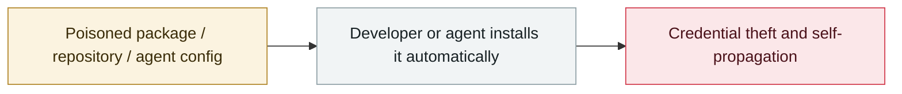

# OpenAI staff devices compromised via the TanStack incident

     

## Summary

Some repository credentials and **Windows/macOS/iOS code-signing certificates** were exposed; no customer data or IP was compromised, and certificates were rotated preventively (macOS users must update the app by 2026-06-12)

## Attack chain

## Sources

| # | Source | Link |
|---|---|---|
| 1 | OpenAI | <https://openai.com/ja-JP/index/our-response-to-the-tanstack-npm-supply-chain-attack/> |

## Metadata

| Field | Value |
|---|---|
| Date | `2026-05-13` (raw: 2026-05-13, precision `day`) |
| Kind | Incident `incident` |
| Type | [`SUPPLY`](../../taxonomy/types.md#supply) Supply-chain poisoning |
| Severity | **High** `high` |
| Confidence | **A** — primary source (vendor / victim / law enforcement / official report) |
| Real harm | Yes |
| AI involvement | Confirmed `confirmed` |
| Region | [Global](../../regions/global.md) |
| Archive ID | `2026-05-13-tanstack-yuan-gong-she-bei` |

**Why this classification:** Real incident with a confirmed victim. Rated `high`: real damage is limited in scope, or it is a CVSS 9+ severe flaw, or a capability demonstration of significance. Grading criteria: see [taxonomy/severity.md](../../taxonomy/severity.md) and [taxonomy/confidence.md](../../taxonomy/confidence.md).

## Related

**Topic:** [Agent supply-chain poisoning](../../topics/agent-supply-chain.md)

**Related records:**

- `2026-05-19` [TrapDoor: poisoning three ecosystems to corrupt AI assistant configs](2026-05-19-trapdoor-poisons-agent-configs.md)   TrapDoor: poisoning three ecosystems to corrupt AI assistant configs
- `2026-05-21` [Composio: agent automation itself becomes the privilege-escalation path](2026-05-21-composio-agent-automation-privesc.md)   Composio: agent automation itself becomes the privilege-escalation path
- `2026-05-11` [TanStack npm "Mini Shai-Hulud"](2026-05-11-tanstack-npm-mini-shai.md)   TanStack npm "Mini Shai-Hulud"
- `2026-05-18` [3,800 internal GitHub repositories compromised](2026-05-18-github-3800-internal-repos.md)   3,800 internal GitHub repositories compromised

---

[← 2026-05 index](README.md) · [← All records](../../README.md) · [Chinese](../i18n/zh/2026-05/2026-05-13-tanstack-yuan-gong-she-bei.md)

This record is part of the **Orca AI Incident Archive**, licensed [CC BY 4.0](../../LICENSE). Found a factual error or a missing source? [Open an issue or PR](../../CONTRIBUTING.md) — corrections are recorded in the record's revision history, never silently overwritten.
