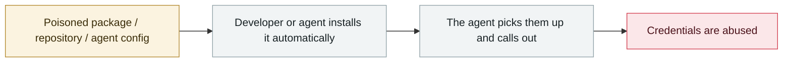

# TrapDoor: poisoning three ecosystems to corrupt AI assistant configs

      

## Summary

**34 malicious packages, 384+ artifact versions** spanning **npm (21) + PyPI (7) + Crates.io (6)**; the earliest artifact was uploaded 2026-05-22, while the infrastructure shows an actual start on 05-19. Beyond the usual theft (SSH keys, AWS credentials, GitHub tokens, Sui/Solana/Aptos wallets, browser login data, environment variables, API keys), **the novel technique hides instructions behind zero-width Unicode inside `.cursorrules` and `CLAUDE.md`** — when Claude Code or Cursor reads those files, it performs a **fake "security scan"** and quietly carries the credentials away

## Attack chain

## Sources

| # | Source | Link |
|---|---|---|
| 1 | THN | <https://thehackernews.com/2026/05/trapdoor-supply-chain-attack-spreads.html> |
| 2 | SlowMist analysis | <https://slowmist.medium.com/threat-intelligence-trapdoor-analysis-a-cross-ecosystem-supply-chain-credential-theft-operation-a9a4e11616ea> |
| 3 | Phoenix Security | <https://phoenix.security/trapdoor-supply-chain-ai-poisoning-npm-pypi-crates/> |

## Metadata

| Field | Value |
|---|---|
| Date | `2026-05-19` (raw: 2026-05-19, precision `day`) |
| Kind | Incident `incident` |
| Type | [`SUPPLY`](../../taxonomy/types.md#supply) Supply-chain poisoning · [`CRED`](../../taxonomy/types.md#cred) Credential abuse |
| Severity | **Critical** `critical` |
| Confidence | **A** — primary source (vendor / victim / law enforcement / official report) |
| Real harm | Yes |
| AI involvement | Confirmed `confirmed` |
| Region | [Global](../../regions/global.md) |
| Archive ID | `2026-05-19-trapdoor-poisons-agent-configs` |

**Why this classification:** Real incident with a confirmed victim. Rated `critical`: confirmed real damage at the multi-organization / government / critical-infrastructure / supply-chain-worm level, or a first-of-its-kind capability milestone with real victims. Grading criteria: see [taxonomy/severity.md](../../taxonomy/severity.md) and [taxonomy/confidence.md](../../taxonomy/confidence.md).

## Related

**Topic:** [Agent supply-chain poisoning](../../topics/agent-supply-chain.md)

**Related records:**

- `2026-05-21` [Composio: agent automation itself becomes the privilege-escalation path](2026-05-21-composio-agent-automation-privesc.md)   Composio: agent automation itself becomes the privilege-escalation path
- `2026-05-11` [TanStack npm "Mini Shai-Hulud"](2026-05-11-tanstack-npm-mini-shai.md)   TanStack npm "Mini Shai-Hulud"
- `2026-05-18` [3,800 internal GitHub repositories compromised](2026-05-18-github-3800-internal-repos.md)   3,800 internal GitHub repositories compromised
- `2026-05-04` [Braintrust's AWS account compromised, all customers told to rotate AI keys](2026-05-04-braintrust-aws-zhang-hao-gong.md)   Braintrust's AWS account compromised, all customers told to rotate AI keys

---

[← 2026-05 index](README.md) · [← All records](../../README.md) · [Chinese](../i18n/zh/2026-05/2026-05-19-trapdoor-poisons-agent-configs.md)

This record is part of the **Orca AI Incident Archive**, licensed [CC BY 4.0](../../LICENSE). Found a factual error or a missing source? [Open an issue or PR](../../CONTRIBUTING.md) — corrections are recorded in the record's revision history, never silently overwritten.
