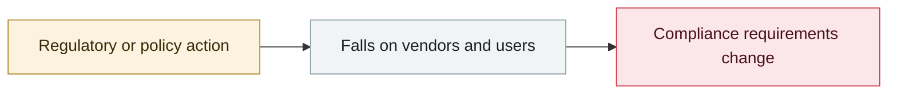

# Google ships Universal Cart, UCP and AP2

     

## Summary

Agent commerce protocols; AP2 (Agent Payments Protocol) imposes strict limits and a verifiable audit trail on AI payments

## Attack chain

## Sources

| # | Source | Link |
|---|---|---|
| 1 | Google | <https://blog.google/intl/ja-jp/products/explore-get-answers/google-shopping-cart/> |

## Metadata

| Field | Value |
|---|---|
| Date | `2026-05-20` (raw: 2026-05-20, precision `day`) |
| Kind | Policy & regulation `policy` |
| Type | [`OTHER`](../../taxonomy/types.md#other) Other |
| Severity | **Info** `info` |
| Confidence | **A** — primary source (vendor / victim / law enforcement / official report) |
| Real harm | n/a |
| AI involvement | Confirmed `confirmed` |
| Region | [Global](../../regions/global.md) |
| Archive ID | `2026-05-20-google-universal-cart-ucp` |

**Why this classification:** Policy / regulatory action, not counted in incident statistics; `severity` is recorded as `info`. Grading criteria: see [taxonomy/severity.md](../../taxonomy/severity.md) and [taxonomy/confidence.md](../../taxonomy/confidence.md).

---

[← 2026-05 index](README.md) · [← All records](../../README.md) · [Chinese](../i18n/zh/2026-05/2026-05-20-google-universal-cart-ucp.md)

This record is part of the **Orca AI Incident Archive**, licensed [CC BY 4.0](../../LICENSE). Found a factual error or a missing source? [Open an issue or PR](../../CONTRIBUTING.md) — corrections are recorded in the record's revision history, never silently overwritten.
