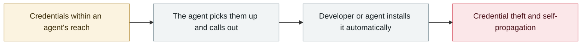

# Composio: agent automation itself becomes the privilege-escalation path

      

## Summary

Agentic integration platform Composio self-disclosed that an attacker exfiltrated **about 5,241 API keys and 5,001 GitHub OAuth tokens**.

The attack chain deserves a note of its own: the attacker **first gained a foothold on an internal agentic tool that monitors Composio's own infrastructure**, then **escalated through the automated remediation system that repairs connector errors**, registered malicious tool definitions in the platform sandbox and finally achieved arbitrary code execution inside the tool-execution sandbox — **an agent meant to automate operations became the attacker's escalation ladder**

## Attack chain

## Sources

| # | Source | Link |
|---|---|---|
| 1 | Composio official incident report | <https://composio.dev/blog/composio-may-2026-security-incident> |
| 2 | Material Security analysis | <https://material.security/resources/the-composio-breach-one-token-10242-doors> |

## Metadata

| Field | Value |
|---|---|
| Date | `2026-05-21` (raw: 2026-05-21, precision `day`) |
| Kind | Incident `incident` |
| Type | [`CRED`](../../taxonomy/types.md#cred) Credential abuse · [`SUPPLY`](../../taxonomy/types.md#supply) Supply-chain poisoning |
| Severity | **Critical** `critical` |
| Confidence | **A** — primary source (vendor / victim / law enforcement / official report) |
| Real harm | Yes |
| AI involvement | Confirmed `confirmed` |
| Region | [Global](../../regions/global.md) |
| Archive ID | `2026-05-21-composio-agent-automation-privesc` |

**Why this classification:** Real incident with a confirmed victim. Rated `critical`: confirmed real damage at the multi-organization / government / critical-infrastructure / supply-chain-worm level, or a first-of-its-kind capability milestone with real victims. Grading criteria: see [taxonomy/severity.md](../../taxonomy/severity.md) and [taxonomy/confidence.md](../../taxonomy/confidence.md).

## Related

**Topic:** [Agent supply-chain poisoning](../../topics/agent-supply-chain.md)

**Related records:**

- `2026-05-19` [TrapDoor: poisoning three ecosystems to corrupt AI assistant configs](2026-05-19-trapdoor-poisons-agent-configs.md)   TrapDoor: poisoning three ecosystems to corrupt AI assistant configs
- `2026-05-11` [TanStack npm "Mini Shai-Hulud"](2026-05-11-tanstack-npm-mini-shai.md)   TanStack npm "Mini Shai-Hulud"
- `2026-05-18` [3,800 internal GitHub repositories compromised](2026-05-18-github-3800-internal-repos.md)   3,800 internal GitHub repositories compromised
- `2026-05-04` [Braintrust's AWS account compromised, all customers told to rotate AI keys](2026-05-04-braintrust-aws-zhang-hao-gong.md)   Braintrust's AWS account compromised, all customers told to rotate AI keys

---

[← 2026-05 index](README.md) · [← All records](../../README.md) · [Chinese](../i18n/zh/2026-05/2026-05-21-composio-agent-automation-privesc.md)

This record is part of the **Orca AI Incident Archive**, licensed [CC BY 4.0](../../LICENSE). Found a factual error or a missing source? [Open an issue or PR](../../CONTRIBUTING.md) — corrections are recorded in the record's revision history, never silently overwritten.
