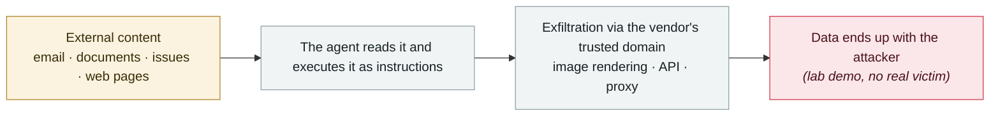

# Microsoft Copilot Cowork file exfiltration

      

## Summary

PromptArmor: poisoning a **"skill" that loads automatically** from a user-controllable path makes the agent generate a message containing a pre-authenticated download link. **That message is auto-approved and sent to the user themselves, bypassing security controls**; the moment the user opens it, the agent sends a request to the attacker's server. **Model-agnostic** (Claude Opus 4.7 behaves the same), with the scheduled-task feature amplifying the threat

## Attack chain

## Sources

| # | Source | Link |
|---|---|---|
| 1 | PromptArmor | <https://www.promptarmor.com/resources/microsoft-copilot-cowork-exfiltrates-files> |

## Metadata

| Field | Value |
|---|---|
| Date | `2026-05-26` (raw: 2026-05-26, precision `day`) |
| Kind | Research demo `research` |
| Type | [`IPI`](../../taxonomy/types.md#ipi) Indirect prompt injection · [`EXFIL`](../../taxonomy/types.md#exfil) Data exfiltration |
| Severity | **High** `high` |
| Confidence | **A** — primary source (vendor / victim / law enforcement / official report) |
| Real harm | No |
| AI involvement | Confirmed `confirmed` |
| Region | [Global](../../regions/global.md) |
| Archive ID | `2026-05-26-microsoft-copilot-cowork` |

**Why this classification:** Controlled demo by a research lab or vendor, `real_harm: false`; the record marks when the attack surface became public. Rated `high`: real damage is limited in scope, or it is a CVSS 9+ severe flaw, or a capability demonstration of significance. Grading criteria: see [taxonomy/severity.md](../../taxonomy/severity.md) and [taxonomy/confidence.md](../../taxonomy/confidence.md).

## Related

**Topic:** [Zero-click data exfiltration chain](../../topics/zero-click-exfil.md)

**Related records:**

- `2026-05-04` [Grok / Bankrbot Morse-code prompt injection](2026-05-04-grok-bankrbot-mo-er-si.md)   Grok / Bankrbot Morse-code prompt injection
- `2026-05-12` [Brazilian labour court sanctions lawyers over prompt injection](2026-05-12-brazil-labor-court-prompt-injection-sanction.md)   Brazilian labour court sanctions lawyers over prompt injection
- `2026-05-12` [ClaudeBleed: a zero-permission extension hijacks Claude for Chrome](2026-05-12-claudebleed-claude-chrome.md)   ClaudeBleed: a zero-permission extension hijacks Claude for Chrome
- `2026-05-22` [Google AI Search "disregard" bug](2026-05-22-google-disregard-bug.md)   Google AI Search "disregard" bug

---

[← 2026-05 index](README.md) · [← All records](../../README.md) · [Chinese](../i18n/zh/2026-05/2026-05-26-microsoft-copilot-cowork.md)

This record is part of the **Orca AI Incident Archive**, licensed [CC BY 4.0](../../LICENSE). Found a factual error or a missing source? [Open an issue or PR](../../CONTRIBUTING.md) — corrections are recorded in the record's revision history, never silently overwritten.
