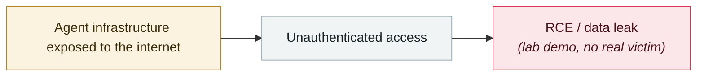

# BadHost (CVE-2026-48710)

     

## Summary

Starlette < 1.0.1 concatenated the un-sanitized HTTP Host header into `request.url`, letting an attacker tamper with `request.url.path` **to bypass path-based authentication middleware**. **Affects FastAPI and the entire Python AI ecosystem, including vLLM, LiteLLM and MCP servers**. Ars Technica's headline: "Millions of AI agents imperiled by critical vulnerability in open source package"

## Attack chain

## Sources

| # | Source | Link |
|---|---|---|
| 1 | badhost.org | <https://badhost.org/> |
| 2 | Ars Technica | <https://arstechnica.com/information-technology/2026/05/millions-of-ai-agents-imperiled-by-critical-vulnerability-in-open-source-package/> |

## Metadata

| Field | Value |
|---|---|
| Date | `2026-05-28` (raw: 2026-05-28, precision `day`) |
| Kind | Research demo `research` |
| Type | [`INFRA`](../../taxonomy/types.md#infra) Agent infrastructure exposure |
| Severity | **High** `high` |
| Confidence | **A** — primary source (vendor / victim / law enforcement / official report) |
| Real harm | No |
| AI involvement | Confirmed `confirmed` |
| Region | [Global](../../regions/global.md) |
| Archive ID | `2026-05-28-badhost` |

**Why this classification:** Controlled demo by a research lab or vendor, `real_harm: false`; the record marks when the attack surface became public. Rated `high`: real damage is limited in scope, or it is a CVSS 9+ severe flaw, or a capability demonstration of significance. Grading criteria: see [taxonomy/severity.md](../../taxonomy/severity.md) and [taxonomy/confidence.md](../../taxonomy/confidence.md).

## Related

**Topic:** [Agent infrastructure exposure](../../topics/agent-infra.md)

**Related records:**

- `2026-05-07` [Semantic Kernel: prompt injection turns into a shell](2026-05-07-semantic-kernel-shell.md)   Semantic Kernel: prompt injection turns into a shell
- `2026-04-16` [MCPwn (CVE-2026-33032): nginx-ui MCP endpoint hit in the wild](../2026-04/2026-04-16-mcpwn-nginx-ui-in-the-wild.md)   MCPwn (CVE-2026-33032): nginx-ui MCP endpoint hit in the wild
- `2026-04-07` [Flowise CVE-2025-59528 exploited in the wild](../2026-04/2026-04-07-flowise-ye-li-yong.md)   Flowise CVE-2025-59528 exploited in the wild
- `2026-04-23` [OpenClaw "Claw Chain": four chained flaws, 245,000 servers exposed](../2026-04/2026-04-23-openclaw-claw-chain.md)   OpenClaw "Claw Chain": four chained flaws, 245,000 servers exposed

---

[← 2026-05 index](README.md) · [← All records](../../README.md) · [Chinese](../i18n/zh/2026-05/2026-05-28-badhost.md)

This record is part of the **Orca AI Incident Archive**, licensed [CC BY 4.0](../../LICENSE). Found a factual error or a missing source? [Open an issue or PR](../../CONTRIBUTING.md) — corrections are recorded in the record's revision history, never silently overwritten.
