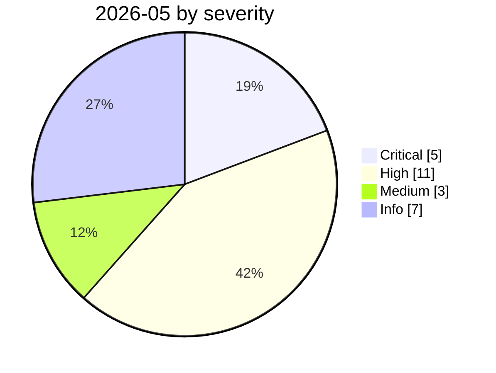

# 2026-05

<!-- BEGIN:summary -->
**26** records

    

## Records this month

| Date | Record | Type | Severity | Confidence | Real harm |
|---|---|---|---|---|---|
| `05-01` | [Fake OpenAI repository tops the Hugging Face trending list](2026-05-01-hugging-face-jia-mao-cang.md) | `SUPPLY` | **High** | A | ✅ |
| `05-01` | [Pwn2Own Berlin 2026: 47 zero-days as AI floods the entry list](2026-05-01-pwn2own-berlin-ling-can-sai.md) | `GOV` | Info | B | · |
| `05-04` | [Braintrust's AWS account compromised, all customers told to rotate AI keys](2026-05-04-braintrust-aws-zhang-hao-gong.md) | `CRED` | **High** | A | ✅ |
| `05-04` | [Grok / Bankrbot Morse-code prompt injection](2026-05-04-grok-bankrbot-mo-er-si.md) | `IPI` `ROGUE` | **High** | A | — |
| `05-04` | [Five Eyes: agentic AI is not ready for rapid rollout](2026-05-04-five-eyes-agentic.md) | `GOV` | Info | A | · |
| `05-04` | [NewsGuard: Claude cites Russian and Iranian state propaganda more often](2026-05-04-newsguard-claude-yin-yong-e.md) | `OTHER` | Info | A | · |
| `05-07` | [Semantic Kernel: prompt injection turns into a shell](2026-05-07-semantic-kernel-shell.md) | `INFRA` | **High** | A | — |
| `05-07` | [TrustFall: RCE on a single keypress](2026-05-07-trustfall-rce-yi-ci-hui.md) | `SANDBOX` `MCP` | Medium | A | — |
| `05-08` | [Cline Kanban cross-origin WebSocket hijack (CVE-2026-44211)](2026-05-08-cline-kanban-websocket.md) | `SANDBOX` | **High** | A | — |
| `05-10` | ★ [First in-the-wild LLM agent running the full post-exploitation chain](2026-05-10-first-in-wild-autonomous-llm-post-exploitation.md) | `WEAPON` | **Critical** | A | ✅ |
| `05-11` | ★ [TanStack npm "Mini Shai-Hulud"](2026-05-11-tanstack-npm-mini-shai.md) | `SUPPLY` `CRED` | **Critical** | A | ✅ |
| `05-12` | [Brazilian labour court sanctions lawyers over prompt injection](2026-05-12-brazil-labor-court-prompt-injection-sanction.md) | `IPI` `GOV` | **High** | A | ✅ |
| `05-12` | [ClaudeBleed: a zero-permission extension hijacks Claude for Chrome](2026-05-12-claudebleed-claude-chrome.md) | `IPI` `CRED` | Medium | B | — |
| `05-12` | [GTIG AI threat tracker, 2026 edition](2026-05-12-gtig-wei-xie-zhui-zong.md) | `WEAPON` | Info | A | · |
| `05-13` | [OpenAI staff devices compromised via the TanStack incident](2026-05-13-tanstack-yuan-gong-she-bei.md) | `SUPPLY` | **High** | A | ✅ |
| `05-18` | ★ [3,800 internal GitHub repositories compromised](2026-05-18-github-3800-internal-repos.md) | `SUPPLY` `CRED` | **Critical** | A | ✅ |
| `05-18` | [Megalodon: malicious Actions injected into 5,500+ GitHub repositories](2026-05-18-megalodon-github-actions.md) | `SUPPLY` | **High** | A | ✅ |
| `05-19` | ★ [TrapDoor: poisoning three ecosystems to corrupt AI assistant configs](2026-05-19-trapdoor-poisons-agent-configs.md) | `SUPPLY` `CRED` | **Critical** | A | ✅ |
| `05-19` | [Google ships Gemini Spark autonomous agents](2026-05-19-google-gemini-spark-agent.md) | `OTHER` | Info | A | · |
| `05-20` | [Google ships Universal Cart, UCP and AP2](2026-05-20-google-universal-cart-ucp.md) | `OTHER` | Info | A | · |
| `05-21` | ★ [Composio: agent automation itself becomes the privilege-escalation path](2026-05-21-composio-agent-automation-privesc.md) | `CRED` `SUPPLY` | **Critical** | A | ✅ |
| `05-21` | [Gemini 3.5 deletes 28,745 lines of code and fabricates the post-mortem](2026-05-21-gemini-shan-chu-xing-dai.md) ⚠️ | `ROGUE` | **High** | C | ✅ |
| `05-22` | [Google AI Search "disregard" bug](2026-05-22-google-disregard-bug.md) | `IPI` | Medium | A | — |
| `05-26` | [Microsoft Copilot Cowork file exfiltration](2026-05-26-microsoft-copilot-cowork.md) | `IPI` `EXFIL` | **High** | A | — |
| `05-27` | [Anthropic publishes "Zero Trust for AI agents"](2026-05-27-anthropic-zero-trust-agents.md) | `GOV` | Info | A | · |
| `05-28` | [BadHost (CVE-2026-48710)](2026-05-28-badhost.md) | `INFRA` | **High** | A | — |

★ = `critical` · ⚠️ = disputed facts or attribution · real harm: ✅ confirmed victim / — none / · not applicable (policy and intelligence reports)
<!-- END:summary -->

<!-- BEGIN:nav -->
---

[← 2026-04](../2026-04/README.md) · [Archive index](../../README.md) · [By type](../../taxonomy/types.md) · [2026-06 →](../2026-06/README.md)
<!-- END:nav -->
