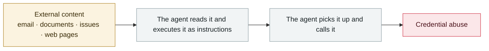

# Attackers simply ask Meta's AI support bot for Instagram accounts

      

## Summary

Attackers used prompt injection to make the AI bind an attacker-controlled email to the target account, **bypassing two-factor authentication**. A textbook "confused deputy" problem — the AI's checks on the attacker's identity were not designed well enough. **About 34,000 accounts** (04-17 → 05-31, 44 days) were taken over and resold by an organized operation; a username alone was enough to start. Meta patched this urgently on **05-29** and restricted the account-recovery API

## Attack chain

## Sources

| # | Source | Link |
|---|---|---|
| 1 | Krebs | <https://krebsonsecurity.com/2026/06/hackers-used-metas-ai-support-bot-to-seize-instagram-accounts/> |
| 2 | 404 Media | <https://www.404media.co/hackers-simply-asked-meta-ai-to-give-them-access-to-high-profile-instagram-accounts-it-worked/> |
| 3 | Ars Technica | <https://arstechnica.com/ai/2026/06/meta-ai-support-chatbot-gave-hackers-access-to-notable-instagram-accounts/> |

## Metadata

| Field | Value |
|---|---|
| Date | `2026-06-01` (raw: 2026-06-01, precision `day`) |
| Kind | Incident `incident` |
| Type | [`IPI`](../../taxonomy/types.md#ipi) Indirect prompt injection · [`CRED`](../../taxonomy/types.md#cred) Credential abuse |
| Severity | **Critical** `critical` |
| Confidence | **A** — primary source (vendor / victim / law enforcement / official report) |
| Real harm | Yes |
| AI involvement | Confirmed `confirmed` |
| Region | [Global](../../regions/global.md) |
| Archive ID | `2026-06-01-meta-ai-support-bot-hands-over-instagram` |

**Why this classification:** Real incident with a confirmed victim. Rated `critical`: confirmed real damage at the multi-organization / government / critical-infrastructure / supply-chain-worm level, or a first-of-its-kind capability milestone with real victims. Grading criteria: see [taxonomy/severity.md](../../taxonomy/severity.md) and [taxonomy/confidence.md](../../taxonomy/confidence.md).

## Related

**Topic:** [Zero-click data exfiltration chain](../../topics/zero-click-exfil.md)

**Related records:**

- `2026-06-01` [Miasma worm](2026-06-01-miasma-worm.md)   Miasma worm
- `2026-06-17` [Sapphire Sleet poisons every Mastra AI scope in 88 minutes](2026-06-17-sapphire-sleet-mastra-88-minutes.md)   Sapphire Sleet poisons every Mastra AI scope in 88 minutes
- `2026-06-04` [Claude Oceanus-v1-p illegally redistributed](2026-06-04-claude-oceanus-fei-fa-fen.md)   Claude Oceanus-v1-p illegally redistributed
- `2026-06-13` [PromptSnatcher: ad-blocking extensions steal AI conversations](2026-06-13-promptsnatcher-guang-gao-lan-jie.md)   PromptSnatcher: ad-blocking extensions steal AI conversations

---

[← 2026-06 index](README.md) · [← All records](../../README.md) · [Chinese](../i18n/zh/2026-06/2026-06-01-meta-ai-support-bot-hands-over-instagram.md)

This record is part of the **Orca AI Incident Archive**, licensed [CC BY 4.0](../../LICENSE). Found a factual error or a missing source? [Open an issue or PR](../../CONTRIBUTING.md) — corrections are recorded in the record's revision history, never silently overwritten.
