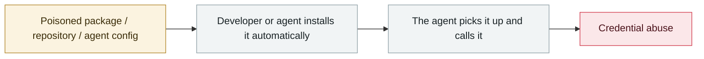

# Miasma worm

      

## Summary

A Mini Shai-Hulud variant that punched through Red Hat's official npm channel. It triggers at npm install time using the **"Phantom Gyp"** trick in `binding.gyp`, and plants persistence hooks in VS Code / Cursor / **Claude Code**. It steals cloud, Kubernetes and repository credentials and sends them to an attacker-controlled GitHub account

## Attack chain

## Sources

| # | Source | Link |
|---|---|---|
| 1 | Ars Technica | <https://arstechnica.com/security/2026/06/dozens-of-red-hat-packages-backdoored-through-its-offical-npm-channel/> |
| 2 | StepSecurity | <https://www.stepsecurity.io/blog/binding-gyp-npm-supply-chain-attack-spreads-like-worm> |
| 3 | safedep | <https://safedep.io/miasma-worm-ai-coding-agent-config-injection/> |

## Metadata

| Field | Value |
|---|---|
| Date | `2026-06-01` (raw: 2026-06-01, precision `day`) |
| Kind | Incident `incident` |
| Type | [`SUPPLY`](../../taxonomy/types.md#supply) Supply-chain poisoning · [`CRED`](../../taxonomy/types.md#cred) Credential abuse |
| Severity | **Critical** `critical` |
| Confidence | **A** — primary source (vendor / victim / law enforcement / official report) |
| Real harm | Yes |
| AI involvement | Confirmed `confirmed` |
| Region | [Global](../../regions/global.md) |
| Archive ID | `2026-06-01-miasma-worm` |

**Why this classification:** Real incident with a confirmed victim. Rated `critical`: confirmed real damage at the multi-organization / government / critical-infrastructure / supply-chain-worm level, or a first-of-its-kind capability milestone with real victims. Grading criteria: see [taxonomy/severity.md](../../taxonomy/severity.md) and [taxonomy/confidence.md](../../taxonomy/confidence.md).

## Related

**Topic:** [Agent supply-chain poisoning](../../topics/agent-supply-chain.md)

**Related records:**

- `2026-06-01` [Attackers simply ask Meta's AI support bot for Instagram accounts](2026-06-01-meta-ai-support-bot-hands-over-instagram.md)   Attackers simply ask Meta's AI support bot for Instagram accounts
- `2026-06-17` [Sapphire Sleet poisons every Mastra AI scope in 88 minutes](2026-06-17-sapphire-sleet-mastra-88-minutes.md)   Sapphire Sleet poisons every Mastra AI scope in 88 minutes
- `2026-06-04` [Claude Oceanus-v1-p illegally redistributed](2026-06-04-claude-oceanus-fei-fa-fen.md)   Claude Oceanus-v1-p illegally redistributed
- `2026-06-13` [PromptSnatcher: ad-blocking extensions steal AI conversations](2026-06-13-promptsnatcher-guang-gao-lan-jie.md)   PromptSnatcher: ad-blocking extensions steal AI conversations

---

[← 2026-06 index](README.md) · [← All records](../../README.md) · [Chinese](../i18n/zh/2026-06/2026-06-01-miasma-worm.md)

This record is part of the **Orca AI Incident Archive**, licensed [CC BY 4.0](../../LICENSE). Found a factual error or a missing source? [Open an issue or PR](../../CONTRIBUTING.md) — corrections are recorded in the record's revision history, never silently overwritten.
