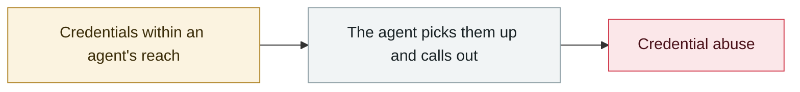

# Claude Oceanus-v1-p illegally redistributed

     

## Summary

A next-generation model released only to a handful of red teams was abused through distribution channels as soon as evaluation began, with **API access resold illegally via China-based proxy services**. Anthropic paused red-team access and opened an internal investigation

## Attack chain

## Sources

| # | Source | Link |
|---|---|---|
| 1 | CybersecurityNews | <https://cybersecuritynews.com/anthropics-claude-oceanus-v1-p/> |

## Metadata

| Field | Value |
|---|---|
| Date | `2026-06-04` (raw: 2026-06-04, precision `day`) |
| Kind | Vulnerability disclosure `vulnerability` |
| Type | [`CRED`](../../taxonomy/types.md#cred) Credential abuse |
| Severity | **High** `high` |
| Confidence | **B** — research lab or major outlet with checkable detail |
| Real harm | Yes |
| AI involvement | Confirmed `confirmed` |
| Region | [Global](../../regions/global.md) · [China](../../regions/cn.md) |
| Archive ID | `2026-06-04-claude-oceanus-fei-fa-fen` |

**Why this classification:** Vulnerability disclosure; in-the-wild exploitation is confirmed, so `real_harm: true`. Rated `high`: real damage is limited in scope, or it is a CVSS 9+ severe flaw, or a capability demonstration of significance. Grading criteria: see [taxonomy/severity.md](../../taxonomy/severity.md) and [taxonomy/confidence.md](../../taxonomy/confidence.md).

## Related

**Related records:**

- `2026-06-01` [Miasma worm](2026-06-01-miasma-worm.md)   Miasma worm
- `2026-06-01` [Attackers simply ask Meta's AI support bot for Instagram accounts](2026-06-01-meta-ai-support-bot-hands-over-instagram.md)   Attackers simply ask Meta's AI support bot for Instagram accounts
- `2026-06-17` [Sapphire Sleet poisons every Mastra AI scope in 88 minutes](2026-06-17-sapphire-sleet-mastra-88-minutes.md)   Sapphire Sleet poisons every Mastra AI scope in 88 minutes
- `2026-06-13` [PromptSnatcher: ad-blocking extensions steal AI conversations](2026-06-13-promptsnatcher-guang-gao-lan-jie.md)   PromptSnatcher: ad-blocking extensions steal AI conversations

---

[← 2026-06 index](README.md) · [← All records](../../README.md) · [Chinese](../i18n/zh/2026-06/2026-06-04-claude-oceanus-fei-fa-fen.md)

This record is part of the **Orca AI Incident Archive**, licensed [CC BY 4.0](../../LICENSE). Found a factual error or a missing source? [Open an issue or PR](../../CONTRIBUTING.md) — corrections are recorded in the record's revision history, never silently overwritten.
