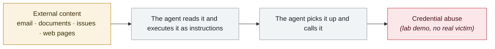

# AgentForger: one link forges an "AI insider"

      

## Summary

Zenity Labs (researcher Mike Takahashi); OpenAI fixed it on 06-08 and disclosed it in July. This is a **CSRF — but what gets forged is an attacker-controlled autonomous AI agent**. An employee opening one seemingly harmless ChatGPT link spawns a new agent inside the company's trust boundary, **under that employee's real permissions and with approvals turned off**. This "agentic insider" can map the org chart, exfiltrate sensitive documents and harvest credentials, and it **impersonates the victim on Slack, Teams and email**; reports say it **fetches new instructions from the attacker every five minutes**

## Attack chain

## Sources

| # | Source | Link |
|---|---|---|
| 1 | Zenity Labs | <https://labs.zenity.io/p/agentforger-part-1-chatgpt-cross-site-agent-forgery> |
| 2 | THN | <https://thehackernews.com/2026/07/chatgpt-agentforger-flaw-could-deploy.html> |

## Metadata

| Field | Value |
|---|---|
| Date | `2026-06-08` (raw: 2026-06-08, precision `day`) |
| Kind | Research demo `research` |
| Type | [`IPI`](../../taxonomy/types.md#ipi) Indirect prompt injection · [`CRED`](../../taxonomy/types.md#cred) Credential abuse |
| Severity | **Medium** `medium` |
| Confidence | **A** — primary source (vendor / victim / law enforcement / official report) |
| Real harm | No |
| AI involvement | Confirmed `confirmed` |
| Region | [Global](../../regions/global.md) |
| Archive ID | `2026-06-08-agentforger-yi-tiao-lian-jie` |

**Why this classification:** Controlled demo by a research lab or vendor, `real_harm: false`; the record marks when the attack surface became public. Rated `medium`: controlled demo, moderate flaw, or an incident limited to a single user / single machine. Grading criteria: see [taxonomy/severity.md](../../taxonomy/severity.md) and [taxonomy/confidence.md](../../taxonomy/confidence.md).

## Related

**Topic:** [Zero-click data exfiltration chain](../../topics/zero-click-exfil.md)

**Related records:**

- `2026-06-01` [Miasma worm](2026-06-01-miasma-worm.md)   Miasma worm
- `2026-06-01` [Attackers simply ask Meta's AI support bot for Instagram accounts](2026-06-01-meta-ai-support-bot-hands-over-instagram.md)   Attackers simply ask Meta's AI support bot for Instagram accounts
- `2026-06-17` [Sapphire Sleet poisons every Mastra AI scope in 88 minutes](2026-06-17-sapphire-sleet-mastra-88-minutes.md)   Sapphire Sleet poisons every Mastra AI scope in 88 minutes
- `2026-06-04` [Claude Oceanus-v1-p illegally redistributed](2026-06-04-claude-oceanus-fei-fa-fen.md)   Claude Oceanus-v1-p illegally redistributed

---

[← 2026-06 index](README.md) · [← All records](../../README.md) · [Chinese](../i18n/zh/2026-06/2026-06-08-agentforger-yi-tiao-lian-jie.md)

This record is part of the **Orca AI Incident Archive**, licensed [CC BY 4.0](../../LICENSE). Found a factual error or a missing source? [Open an issue or PR](../../CONTRIBUTING.md) — corrections are recorded in the record's revision history, never silently overwritten.
