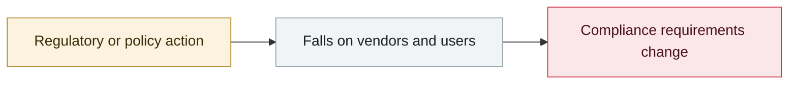

# CISA BOD 26-04

     

## Summary

Risk-based remediation deadlines across four tiers, with the highest-risk tier requiring **remediation within 3 days plus forensic triage**. The stated rationale: **threat actors' use of AI will compress the defensive window further**. Replaces BOD 19-02 and 22-01

## Attack chain

## Sources

| # | Source | Link |
|---|---|---|
| 1 | CISA | <https://www.cisa.gov/news-events/directives/bod-26-04-prioritizing-security-updates-based-risk> |

## Metadata

| Field | Value |
|---|---|
| Date | `2026-06-11` (raw: 2026-06-11, precision `day`) |
| Kind | Policy & regulation `policy` |
| Type | [`GOV`](../../taxonomy/types.md#gov) Governance & policy |
| Severity | **Info** `info` |
| Confidence | **A** — primary source (vendor / victim / law enforcement / official report) |
| Real harm | n/a |
| AI involvement | Confirmed `confirmed` |
| Region | [United States](../../regions/us.md) |
| Archive ID | `2026-06-11-cisa-bod` |

**Why this classification:** Policy / regulatory action, not counted in incident statistics; `severity` is recorded as `info`. Grading criteria: see [taxonomy/severity.md](../../taxonomy/severity.md) and [taxonomy/confidence.md](../../taxonomy/confidence.md).

## Related

**Topic:** [Defense & governance](../../topics/defense.md)

**Related records:**

- `2026-06-09` [Anthropic Claude Fable 5 GA, Mythos 5 limited release](2026-06-09-anthropic-claude-fable-ga.md)   Anthropic Claude Fable 5 GA, Mythos 5 limited release
- `2026-06-12` [US government issues export controls to Anthropic](2026-06-12-anthropic-mei-guo-zheng-fu.md)   US government issues export controls to Anthropic
- `2026-06-12` [Google sues the China-linked "Outsider Enterprise" smishing network](2026-06-12-google-outsider-enterprise.md)   Google sues the China-linked "Outsider Enterprise" smishing network
- `2026-06-23` [Five Eyes joint statement to boards and executives](2026-06-23-five-eyes-zhi-qi-ye.md)   Five Eyes joint statement to boards and executives

---

[← 2026-06 index](README.md) · [← All records](../../README.md) · [Chinese](../i18n/zh/2026-06/2026-06-11-cisa-bod.md)

This record is part of the **Orca AI Incident Archive**, licensed [CC BY 4.0](../../LICENSE). Found a factual error or a missing source? [Open an issue or PR](../../CONTRIBUTING.md) — corrections are recorded in the record's revision history, never silently overwritten.
