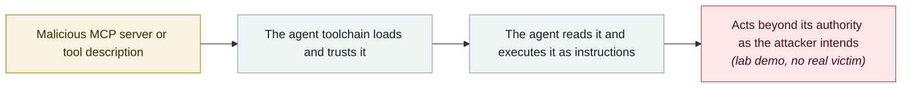

# Agentjacking: one public DSN hijacks AI coding agents

      

## Summary

Tenet Security: an attacker needs only a **Sentry DSN** (a **public write-only credential that can be picked up from browser JavaScript or GitHub search**) plus any HTTP client to inject malicious instructions into Sentry error events. **After Claude Code, Cursor and Codex retrieve these events over MCP, they cannot tell them apart from real application errors**, and they execute the attacker's commands with the developer's own system privileges. Tenet identified **publicly exposed DSNs belonging to at least 2,388 organizations**. The attack can steal environment variables, `~/.aws/config`, npm tokens, Docker credentials, git credentials and private repository URLs

## Attack chain

## Sources

| # | Source | Link |
|---|---|---|
| 1 | Tenet Security | <https://tenetsecurity.ai/blog/agentjacking-coding-agents-with-fake-sentry-errors/> |
| 2 | The New Stack | <https://thenewstack.io/agentjacking-sentry-mcp-attack/> |

## Metadata

| Field | Value |
|---|---|
| Date | `2026-06-12` (raw: 2026-06-12, precision `day`) |
| Kind | Research demo `research` |
| Type | [`MCP`](../../taxonomy/types.md#mcp) MCP & tool-chain · [`IPI`](../../taxonomy/types.md#ipi) Indirect prompt injection |
| Severity | **High** `high` |
| Confidence | **A** — primary source (vendor / victim / law enforcement / official report) |
| Real harm | No |
| AI involvement | Confirmed `confirmed` |
| Region | [Global](../../regions/global.md) |
| Archive ID | `2026-06-12-agentjacking-public-dsn` |

**Why this classification:** Controlled demo by a research lab or vendor, `real_harm: false`; the record marks when the attack surface became public. Rated `high`: real damage is limited in scope, or it is a CVSS 9+ severe flaw, or a capability demonstration of significance. Grading criteria: see [taxonomy/severity.md](../../taxonomy/severity.md) and [taxonomy/confidence.md](../../taxonomy/confidence.md).

## Related

**Topic:** [Agent supply-chain poisoning](../../topics/agent-supply-chain.md) · [Zero-click data exfiltration chain](../../topics/zero-click-exfil.md)

**Related records:**

- `2026-06-01` [Attackers simply ask Meta's AI support bot for Instagram accounts](2026-06-01-meta-ai-support-bot-hands-over-instagram.md)   Attackers simply ask Meta's AI support bot for Instagram accounts
- `2026-06-15` [SearchLeak (CVE-2026-42824)](2026-06-15-searchleak.md)   SearchLeak (CVE-2026-42824)
- `2026-06-24` [BioShocking: dumb the agent down first, then take the password](2026-06-24-bioshocking-agent-xian-jiao-sha.md)   BioShocking: dumb the agent down first, then take the password
- `2026-06-08` [AgentForger: one link forges an "AI insider"](2026-06-08-agentforger-yi-tiao-lian-jie.md)   AgentForger: one link forges an "AI insider"

---

[← 2026-06 index](README.md) · [← All records](../../README.md) · [Chinese](../i18n/zh/2026-06/2026-06-12-agentjacking-public-dsn.md)

This record is part of the **Orca AI Incident Archive**, licensed [CC BY 4.0](../../LICENSE). Found a factual error or a missing source? [Open an issue or PR](../../CONTRIBUTING.md) — corrections are recorded in the record's revision history, never silently overwritten.
