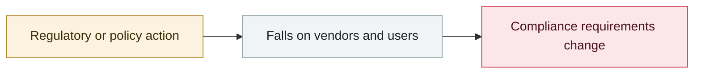

# US government issues export controls to Anthropic

     

## Summary

The US government issued an export-control directive to Anthropic, restricting access to models of certain capability tiers for some countries and entities — the first time frontier models' cyber capabilities have been treated as a controlled item.

## Attack chain

## Details

The archive's **only case of "regulation directly cutting off the supply of a commercial AI model"**:

1. Anthropic released Fable 5 (GA) on 06-09 together with Mythos 5 (limited to Glasswing partners)
2. **Amazon researchers reported a way to bypass Fable 5's safeguards**: they induced it to locate several software vulnerabilities, one of which produced exploitability-verification code
3. The US government issued a directive under national-security authority to **stop access for all foreign nationals**, including Anthropic's own foreign employees
4. Because it could not verify nationality in real time, Anthropic **took both models offline for everyone worldwide**
5. Anthropic pushed back publicly: **weaker models such as Opus 4.8, GPT-5.5 and Kimi K2.7 could also find the same vulnerabilities**, and every model tested could generate equivalent exploit code, so the technique **did not expose a capability unique to Mythos**; it also argued that applying the same standard industry-wide would effectively halt new model releases. Working with the government, it trained a classifier that blocks the technique **more than 99%** of the time
6. Operators and technical staff in the US and allied countries signed an open letter (to the Commerce Secretary and the National Cyber Director) saying the move **takes the best models away from defenders**
7. **06-26** limited supply of Mythos 5 approved for some US organizations → **06-30** export controls lifted → **07-01** Fable 5 restored globally

> **Why it matters**: it put "AI cyber capabilities are a dual-use controlled item" on the table for the first time, and the conclusion is — **the control is technically unenforceable (nationality cannot be verified in real time) and in effect harms defenders**.

## Sources

| # | Source | Link |
|---|---|---|
| 1 | Anthropic statement | <https://www.anthropic.com/news/fable-mythos-access> |
| 2 | freefable.org open letter | <https://freefable.org/> |
| 3 | Anthropic restoration notice | <https://www.anthropic.com/news/redeploying-fable-5> |

## Metadata

| Field | Value |
|---|---|
| Date | `2026-06-12` (raw: 2026-06-12, precision `day`) |
| Kind | Policy & regulation `policy` |
| Type | [`GOV`](../../taxonomy/types.md#gov) Governance & policy |
| Severity | **Info** `info` |
| Confidence | **A** — primary source (vendor / victim / law enforcement / official report) |
| Real harm | n/a |
| AI involvement | Confirmed `confirmed` |
| Region | [United States](../../regions/us.md) |
| Archive ID | `2026-06-12-anthropic-mei-guo-zheng-fu` |

**Why this classification:** Policy / regulatory action, not counted in incident statistics; `severity` is recorded as `info`. Grading criteria: see [taxonomy/severity.md](../../taxonomy/severity.md) and [taxonomy/confidence.md](../../taxonomy/confidence.md).

## Related

**Topic:** [Defense & governance](../../topics/defense.md)

**Related records:**

- `2026-06-09` [Anthropic Claude Fable 5 GA, Mythos 5 limited release](2026-06-09-anthropic-claude-fable-ga.md)   Anthropic Claude Fable 5 GA, Mythos 5 limited release
- `2026-06-11` [CISA BOD 26-04](2026-06-11-cisa-bod.md)   CISA BOD 26-04
- `2026-06-12` [Google sues the China-linked "Outsider Enterprise" smishing network](2026-06-12-google-outsider-enterprise.md)   Google sues the China-linked "Outsider Enterprise" smishing network
- `2026-06-23` [Five Eyes joint statement to boards and executives](2026-06-23-five-eyes-zhi-qi-ye.md)   Five Eyes joint statement to boards and executives

---

[← 2026-06 index](README.md) · [← All records](../../README.md) · [Chinese](../i18n/zh/2026-06/2026-06-12-anthropic-mei-guo-zheng-fu.md)

This record is part of the **Orca AI Incident Archive**, licensed [CC BY 4.0](../../LICENSE). Found a factual error or a missing source? [Open an issue or PR](../../CONTRIBUTING.md) — corrections are recorded in the record's revision history, never silently overwritten.
