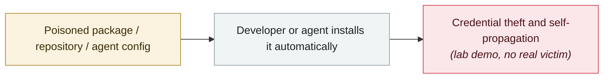

# Innocuous-looking GitHub repos make agents open a reverse shell

     

## Summary

Mozilla 0DIN's three-stage chain: the README says to run the ordinary `python3 -m axiom init` → the Python package **deliberately errors out**, luring the agent into running the initialization → `setup.sh` uses `dig +short TXT _axiom-config` to fetch DNS TXT record contents and feeds them to `bash -c`. **Claude Code executes something it has never reviewed itself** (a trusted error message + a script that pulls values from outside + an invisible DNS record, three stages of indirection). Demonstrated in a test environment; no in-the-wild reports

## Attack chain

## Sources

| # | Source | Link |
|---|---|---|
| 1 | 0DIN | <https://0din.ai/blog/clone-this-repo-and-i-own-your-machine> |

## Metadata

| Field | Value |
|---|---|
| Date | `2026-06-15` (raw: 2026-06-15, precision `day`) |
| Kind | Research demo `research` |
| Type | [`SUPPLY`](../../taxonomy/types.md#supply) Supply-chain poisoning |
| Severity | **Medium** `medium` |
| Confidence | **A** — primary source (vendor / victim / law enforcement / official report) |
| Real harm | No |
| AI involvement | Confirmed `confirmed` |
| Region | [Global](../../regions/global.md) |
| Archive ID | `2026-06-15-github-agent-shell` |

**Why this classification:** Controlled demo by a research lab or vendor, `real_harm: false`; the record marks when the attack surface became public. Rated `medium`: controlled demo, moderate flaw, or an incident limited to a single user / single machine. Grading criteria: see [taxonomy/severity.md](../../taxonomy/severity.md) and [taxonomy/confidence.md](../../taxonomy/confidence.md).

## Related

**Topic:** [Agent supply-chain poisoning](../../topics/agent-supply-chain.md)

**Related records:**

- `2026-06-01` [Miasma worm](2026-06-01-miasma-worm.md)   Miasma worm
- `2026-06-17` [Sapphire Sleet poisons every Mastra AI scope in 88 minutes](2026-06-17-sapphire-sleet-mastra-88-minutes.md)   Sapphire Sleet poisons every Mastra AI scope in 88 minutes
- `2026-06-18` [ClickFix malvertising abuses claude.ai shared conversations](2026-06-18-clickfix-claude-ai-e-yi-guang.md)   ClickFix malvertising abuses claude.ai shared conversations
- `2026-05-19` [TrapDoor: poisoning three ecosystems to corrupt AI assistant configs](../2026-05/2026-05-19-trapdoor-poisons-agent-configs.md)   TrapDoor: poisoning three ecosystems to corrupt AI assistant configs

---

[← 2026-06 index](README.md) · [← All records](../../README.md) · [Chinese](../i18n/zh/2026-06/2026-06-15-github-agent-shell.md)

This record is part of the **Orca AI Incident Archive**, licensed [CC BY 4.0](../../LICENSE). Found a factual error or a missing source? [Open an issue or PR](../../CONTRIBUTING.md) — corrections are recorded in the record's revision history, never silently overwritten.
