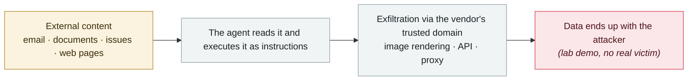

# SearchLeak (CVE-2026-42824)

      

## Summary

Varonis's three-stage chain: ① the `q` parameter of a search URL is treated as instructions ② sanitization is **post-processing after generation**, so an `` in the streaming render has already fired its request ③ CSP allows `*.bing.com`, and **Bing image search fetches the specified URL server-side, out of reach of the browser CSP**. The lure domain is microsoft.com, and Copilot runs with the user's privileges — a victim who **clicks one link** leaks mail, security codes, calendar, SharePoint and OneDrive. Microsoft has fixed it and users need do nothing; Varonis says Microsoft rated it critical while the MSRC page shows a base score of 6.5

## Attack chain

## Sources

| # | Source | Link |
|---|---|---|
| 1 | Varonis | <https://www.varonis.com/blog/searchleak> |
| 2 | MSRC | <https://msrc.microsoft.com/update-guide/vulnerability/CVE-2026-42824> |

## Metadata

| Field | Value |
|---|---|
| Date | `2026-06-15` (raw: 2026-06-15, precision `day`) |
| Kind | Research demo `research` |
| Type | [`IPI`](../../taxonomy/types.md#ipi) Indirect prompt injection · [`EXFIL`](../../taxonomy/types.md#exfil) Data exfiltration |
| Severity | **Medium** `medium` |
| Confidence | **A** — primary source (vendor / victim / law enforcement / official report) |
| Real harm | No |
| AI involvement | Confirmed `confirmed` |
| Region | [Global](../../regions/global.md) |
| Archive ID | `2026-06-15-searchleak` |

**Why this classification:** Controlled demo by a research lab or vendor, `real_harm: false`; the record marks when the attack surface became public. Rated `medium`: controlled demo, moderate flaw, or an incident limited to a single user / single machine. Grading criteria: see [taxonomy/severity.md](../../taxonomy/severity.md) and [taxonomy/confidence.md](../../taxonomy/confidence.md).

## Related

**Topic:** [Zero-click data exfiltration chain](../../topics/zero-click-exfil.md)

**Related records:**

- `2026-06-01` [Attackers simply ask Meta's AI support bot for Instagram accounts](2026-06-01-meta-ai-support-bot-hands-over-instagram.md)   Attackers simply ask Meta's AI support bot for Instagram accounts
- `2026-06-12` [Agentjacking: one public DSN hijacks AI coding agents](2026-06-12-agentjacking-public-dsn.md)   Agentjacking: one public DSN hijacks AI coding agents
- `2026-06-24` [BioShocking: dumb the agent down first, then take the password](2026-06-24-bioshocking-agent-xian-jiao-sha.md)   BioShocking: dumb the agent down first, then take the password
- `2026-06-08` [AgentForger: one link forges an "AI insider"](2026-06-08-agentforger-yi-tiao-lian-jie.md)   AgentForger: one link forges an "AI insider"

---

[← 2026-06 index](README.md) · [← All records](../../README.md) · [Chinese](../i18n/zh/2026-06/2026-06-15-searchleak.md)

This record is part of the **Orca AI Incident Archive**, licensed [CC BY 4.0](../../LICENSE). Found a factual error or a missing source? [Open an issue or PR](../../CONTRIBUTING.md) — corrections are recorded in the record's revision history, never silently overwritten.
