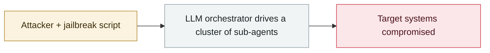

# UNC6508 breaches North American research institutions via REDCap

     

## Summary

GTIG attributes this with high confidence to a China-linked actor. Targets included national, state and civilian medical institutions, academic centers and military medical facilities; the actor collected defense information, Indo-Pacific military operations, AI, drone systems and medical research. Earliest intrusion in 2023-09, with activity at one institution continuing into 2025-11. It planted INFINITERED, which rewrites legitimate REDCap files and re-injects itself on every upgrade, surviving for over a year. It abused the compliance rule **"Patroit"** to regex-match sent and received mail and silently BCC it to an attacker Gmail account — **GTIG calls this unprecedented among China-linked actors**

## Attack chain

## Sources

| # | Source | Link |
|---|---|---|
| 1 | Google Cloud | <https://cloud.google.com/blog/topics/threat-intelligence/prc-targets-us-medical-research> |

## Metadata

| Field | Value |
|---|---|
| Date | `2026-06-15` (raw: 2026-06-15, precision `day`) |
| Kind | Incident `incident` |
| Type | [`WEAPON`](../../taxonomy/types.md#weapon) Agent used as a weapon |
| Severity | **High** `high` |
| Confidence | **A** — primary source (vendor / victim / law enforcement / official report) |
| Real harm | Yes |
| AI involvement | Confirmed `confirmed` |
| Region | [United States](../../regions/us.md) |
| Archive ID | `2026-06-15-unc6508-redcap-jing-ru-qin` |

**Why this classification:** Real incident with a confirmed victim. Rated `high`: real damage is limited in scope, or it is a CVSS 9+ severe flaw, or a capability demonstration of significance. Grading criteria: see [taxonomy/severity.md](../../taxonomy/severity.md) and [taxonomy/confidence.md](../../taxonomy/confidence.md).

## Related

**Topic:** [Offensive AI capability evolution](../../topics/offensive-ai.md)

**Related records:**

- `2026-06-02` [CleverHans Lab adaptive AI worm PoC](2026-06-02-cleverhans-lab-poc.md)   CleverHans Lab adaptive AI worm PoC
- `2026-06-24` [macOS.Gaslight: malware prompt-injects the AI analyst](2026-06-24-macos-gaslight-e-yi-ruan-jian.md)   macOS.Gaslight: malware prompt-injects the AI analyst
- `2026-06-03` [Anthropic, "LLM ATT&CK Navigator"](2026-06-03-anthropic-llm-att-ck.md)   Anthropic, "LLM ATT&CK Navigator"
- `2026-06-09` [Anthropic: N-day is really "N-hour"](2026-06-09-anthropic-day-hour.md)   Anthropic: N-day is really "N-hour"

---

[← 2026-06 index](README.md) · [← All records](../../README.md) · [Chinese](../i18n/zh/2026-06/2026-06-15-unc6508-redcap-jing-ru-qin.md)

This record is part of the **Orca AI Incident Archive**, licensed [CC BY 4.0](../../LICENSE). Found a factual error or a missing source? [Open an issue or PR](../../CONTRIBUTING.md) — corrections are recorded in the record's revision history, never silently overwritten.
