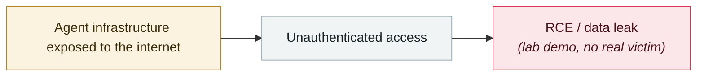

# Vertex AI SDK bucket takeover leads to cross-tenant RCE

     

## Summary

Unit 42: when no bucket name is specified, SDK v1.139.0/1.140.0 derives the name from the project ID + region, **checking existence but not validating ownership**. An attacker who creates a bucket with the same name first and opens it for read/write to any authenticated identity can receive the victim's uploaded models; by swapping them within a race window of about **2.5 seconds** (a Cloud Function responds in about 800ms, and in practice the swap completed about 1 second before the read), pickle deserialization gives RCE. Google fixed it in two stages: v1.144.0 added a uuid4, v1.148.0 added an ownership check

## Attack chain

## Sources

| # | Source | Link |
|---|---|---|
| 1 | Unit 42 | <https://unit42.paloaltonetworks.com/hijacking-vertex-ai-model/> |

## Metadata

| Field | Value |
|---|---|
| Date | `2026-06-17` (raw: 2026-06-17, precision `day`) |
| Kind | Research demo `research` |
| Type | [`INFRA`](../../taxonomy/types.md#infra) Agent infrastructure exposure |
| Severity | **Medium** `medium` |
| Confidence | **A** — primary source (vendor / victim / law enforcement / official report) |
| Real harm | No |
| AI involvement | Confirmed `confirmed` |
| Region | [Global](../../regions/global.md) |
| Archive ID | `2026-06-17-vertex-sdk-rce` |

**Why this classification:** Controlled demo by a research lab or vendor, `real_harm: false`; the record marks when the attack surface became public. Rated `medium`: controlled demo, moderate flaw, or an incident limited to a single user / single machine. Grading criteria: see [taxonomy/severity.md](../../taxonomy/severity.md) and [taxonomy/confidence.md](../../taxonomy/confidence.md).

## Related

**Topic:** [Agent infrastructure exposure](../../topics/agent-infra.md)

**Related records:**

- `2026-06-08` [LiteLLM CVE-2026-42271 MCP endpoint takeover](2026-06-08-litellm-mcp-duan-dian-jie.md)   LiteLLM CVE-2026-42271 MCP endpoint takeover
- `2026-06-29` [DifyTap: four flaws leave 1M+ AI apps open to cross-tenant eavesdropping](2026-06-29-difytap-lou-dong-rang-wan.md)   DifyTap: four flaws leave 1M+ AI apps open to cross-tenant eavesdropping
- `2026-06-28` [Langflow CVE-2026-33017 used for Monero mining](2026-06-28-langflow-yong-yu-men-luo.md)   Langflow CVE-2026-33017 used for Monero mining
- `2026-06-18` [AutoJack: one web page from AutoGen Studio to the host](2026-06-18-autojack-autogen-studio.md)   AutoJack: one web page from AutoGen Studio to the host

---

[← 2026-06 index](README.md) · [← All records](../../README.md) · [Chinese](../i18n/zh/2026-06/2026-06-17-vertex-sdk-rce.md)

This record is part of the **Orca AI Incident Archive**, licensed [CC BY 4.0](../../LICENSE). Found a factual error or a missing source? [Open an issue or PR](../../CONTRIBUTING.md) — corrections are recorded in the record's revision history, never silently overwritten.
