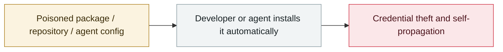

# ClickFix malvertising abuses claude.ai shared conversations

     

## Summary

TrendAI: from 2026-04-08 → 06-14, Google ads impersonated at least 6 brands including Claude AI, Cursor IDE and ChatGPT Codex; 6 waves over 7 weeks, **106 hostnames**. It started with fake GitLab Pages sites, then **from 05-06 hosted the ClickFix steps in claude.ai's public shared-conversation feature**, and after 05-21 all activity ran on that feature. Posing as Apple Support, it lured users into pasting base64-obfuscated commands; the script **aborts when it detects a Russian keyboard layout**, otherwise it drops MacSync to steal credentials, cookies, SSH keys and crypto wallets. **67.4% of victim traffic came from Asia-Pacific, with Taiwan alone accounting for 30.5%**. After being notified, Anthropic disabled the related accounts and the malicious shared conversations

## Attack chain

## Sources

| # | Source | Link |
|---|---|---|
| 1 | Trend Micro | <https://www.trendmicro.com/en/research/26/f/claudeai-shared-chat-abused-in-malvertising.html> |

## Metadata

| Field | Value |
|---|---|
| Date | `2026-06-18` (raw: 2026-06-18, precision `day`) |
| Kind | Incident `incident` |
| Type | [`SUPPLY`](../../taxonomy/types.md#supply) Supply-chain poisoning |
| Severity | **High** `high` |
| Confidence | **A** — primary source (vendor / victim / law enforcement / official report) |
| Real harm | Yes |
| AI involvement | Confirmed `confirmed` |
| Region | [Global](../../regions/global.md) · [Asia-Pacific](../../regions/apac.md) |
| Archive ID | `2026-06-18-clickfix-claude-ai-e-yi-guang` |

**Why this classification:** Real incident with a confirmed victim. Rated `high`: real damage is limited in scope, or it is a CVSS 9+ severe flaw, or a capability demonstration of significance. Grading criteria: see [taxonomy/severity.md](../../taxonomy/severity.md) and [taxonomy/confidence.md](../../taxonomy/confidence.md).

## Related

**Topic:** [Agent supply-chain poisoning](../../topics/agent-supply-chain.md)

**Related records:**

- `2026-06-01` [Miasma worm](2026-06-01-miasma-worm.md)   Miasma worm
- `2026-06-17` [Sapphire Sleet poisons every Mastra AI scope in 88 minutes](2026-06-17-sapphire-sleet-mastra-88-minutes.md)   Sapphire Sleet poisons every Mastra AI scope in 88 minutes
- `2026-06-15` [Innocuous-looking GitHub repos make agents open a reverse shell](2026-06-15-github-agent-shell.md)   Innocuous-looking GitHub repos make agents open a reverse shell
- `2026-05-19` [TrapDoor: poisoning three ecosystems to corrupt AI assistant configs](../2026-05/2026-05-19-trapdoor-poisons-agent-configs.md)   TrapDoor: poisoning three ecosystems to corrupt AI assistant configs

---

[← 2026-06 index](README.md) · [← All records](../../README.md) · [Chinese](../i18n/zh/2026-06/2026-06-18-clickfix-claude-ai-e-yi-guang.md)

This record is part of the **Orca AI Incident Archive**, licensed [CC BY 4.0](../../LICENSE). Found a factual error or a missing source? [Open an issue or PR](../../CONTRIBUTING.md) — corrections are recorded in the record's revision history, never silently overwritten.
