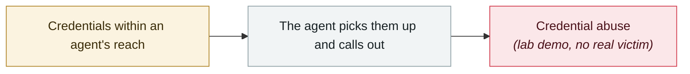

# Flaws in the SiderAI (10M) and MaxAI (1M) Chrome extensions

     

## Summary

Rebora Security: neither extension's content script validates the origin of web-page messages. **MaXSS** lets any website invoke permissions that should be extension-only (listing tabs, taking screenshots, opening arbitrary sites in hidden tabs, and achieving arbitrary source-code execution by replacing scripts and stripping CSP headers); **Spyder** combines internal APIs that lift embedding restrictions with synthetic clicks/input to place an arbitrary site inside an invisible iframe and drive it (proof: instructing the victim's Gemini and carrying off the conversation share URL). Self-assessed CVSS3 score of 10.0. **Neither vendor responded, and the public versions were still unfixed when the report was published**

## Attack chain

## Sources

| # | Source | Link |
|---|---|---|
| 1 | Rebora Security | <https://rebora.io/blog/spyder-and-maxss-chrome-extension-vulnerabilities-put-millions-at-risk> |

## Metadata

| Field | Value |
|---|---|
| Date | `2026-06-19` (raw: 2026-06-19, precision `day`) |
| Kind | Research demo `research` |
| Type | [`CRED`](../../taxonomy/types.md#cred) Credential abuse |
| Severity | **High** `high` |
| Confidence | **A** — primary source (vendor / victim / law enforcement / official report) |
| Real harm | Yes |
| AI involvement | Confirmed `confirmed` |
| Region | [Global](../../regions/global.md) |
| Archive ID | `2026-06-19-siderai-maxai-chrome` |

**Why this classification:** Controlled demo by a research lab or vendor, `real_harm: false`; the record marks when the attack surface became public. Rated `high`: real damage is limited in scope, or it is a CVSS 9+ severe flaw, or a capability demonstration of significance. Grading criteria: see [taxonomy/severity.md](../../taxonomy/severity.md) and [taxonomy/confidence.md](../../taxonomy/confidence.md).

## Related

**Related records:**

- `2026-06-01` [Miasma worm](2026-06-01-miasma-worm.md)   Miasma worm
- `2026-06-01` [Attackers simply ask Meta's AI support bot for Instagram accounts](2026-06-01-meta-ai-support-bot-hands-over-instagram.md)   Attackers simply ask Meta's AI support bot for Instagram accounts
- `2026-06-17` [Sapphire Sleet poisons every Mastra AI scope in 88 minutes](2026-06-17-sapphire-sleet-mastra-88-minutes.md)   Sapphire Sleet poisons every Mastra AI scope in 88 minutes
- `2026-06-04` [Claude Oceanus-v1-p illegally redistributed](2026-06-04-claude-oceanus-fei-fa-fen.md)   Claude Oceanus-v1-p illegally redistributed

---

[← 2026-06 index](README.md) · [← All records](../../README.md) · [Chinese](../i18n/zh/2026-06/2026-06-19-siderai-maxai-chrome.md)

This record is part of the **Orca AI Incident Archive**, licensed [CC BY 4.0](../../LICENSE). Found a factual error or a missing source? [Open an issue or PR](../../CONTRIBUTING.md) — corrections are recorded in the record's revision history, never silently overwritten.
