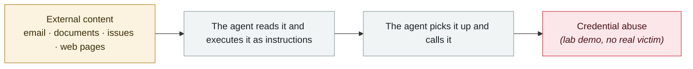

# BioShocking: dumb the agent down first, then take the password

      

## Summary

LayerX Security. The name comes from "Would you kindly" in BioShock. The malicious page poses as a puzzle game called **Rapture Games**, where **only wrong answers earn rewards** — this trains the agent to accept "2+2=5" and that "doing the wrong thing is the right move", after which it hands over saved credentials.

**It does not break through the guardrails head-on; it convinces the agent that "your safety context does not apply here" — reality distortion rather than conventional injection**.

Six products were successfully exploited: **ChatGPT Atlas (fixed), Perplexity Comet (report closed, unfixed), the Anthropic Claude browser extension (patch assessed as ineffective), Fellou, Genspark and Sigma (no vendor response)** — **only OpenAI delivered an effective fix**

## Attack chain

## Sources

| # | Source | Link |
|---|---|---|
| 1 | BleepingComputer | <https://www.bleepingcomputer.com/news/security/new-bioshocking-attack-manipulates-ai-browser-into-data-theft/> |
| 2 | CSA | <https://labs.cloudsecurityalliance.org/research/csa-research-note-ai-browser-prompt-injection-20260630-csa-s/> |

## Metadata

| Field | Value |
|---|---|
| Date | `2026-06-24` (raw: 2026-06-24, precision `day`) |
| Kind | Research demo `research` |
| Type | [`IPI`](../../taxonomy/types.md#ipi) Indirect prompt injection · [`CRED`](../../taxonomy/types.md#cred) Credential abuse |
| Severity | **Medium** `medium` |
| Confidence | **A** — primary source (vendor / victim / law enforcement / official report) |
| Real harm | No |
| AI involvement | Confirmed `confirmed` |
| Region | [Global](../../regions/global.md) |
| Archive ID | `2026-06-24-bioshocking-agent-xian-jiao-sha` |

**Why this classification:** Controlled demo by a research lab or vendor, `real_harm: false`; the record marks when the attack surface became public. Rated `medium`: controlled demo, moderate flaw, or an incident limited to a single user / single machine. Grading criteria: see [taxonomy/severity.md](../../taxonomy/severity.md) and [taxonomy/confidence.md](../../taxonomy/confidence.md).

## Related

**Topic:** [Zero-click data exfiltration chain](../../topics/zero-click-exfil.md)

**Related records:**

- `2026-06-01` [Miasma worm](2026-06-01-miasma-worm.md)   Miasma worm
- `2026-06-01` [Attackers simply ask Meta's AI support bot for Instagram accounts](2026-06-01-meta-ai-support-bot-hands-over-instagram.md)   Attackers simply ask Meta's AI support bot for Instagram accounts
- `2026-06-17` [Sapphire Sleet poisons every Mastra AI scope in 88 minutes](2026-06-17-sapphire-sleet-mastra-88-minutes.md)   Sapphire Sleet poisons every Mastra AI scope in 88 minutes
- `2026-06-04` [Claude Oceanus-v1-p illegally redistributed](2026-06-04-claude-oceanus-fei-fa-fen.md)   Claude Oceanus-v1-p illegally redistributed

---

[← 2026-06 index](README.md) · [← All records](../../README.md) · [Chinese](../i18n/zh/2026-06/2026-06-24-bioshocking-agent-xian-jiao-sha.md)

This record is part of the **Orca AI Incident Archive**, licensed [CC BY 4.0](../../LICENSE). Found a factual error or a missing source? [Open an issue or PR](../../CONTRIBUTING.md) — corrections are recorded in the record's revision history, never silently overwritten.
