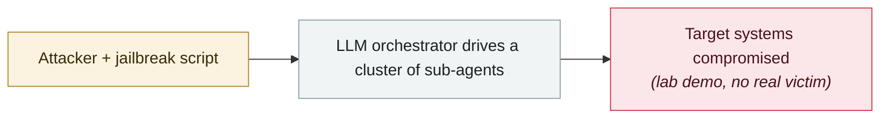

# macOS.Gaslight: malware prompt-injects the AI analyst

     

## Summary

SentinelLABS: a North Korea-linked Rust implant contains a **3.5KB data block** that uses Markdown code fences and `{{DATA}}` tokens to **mimic the prompt structure of LLM analysis platforms**, laying out **38 fake system messages** (token expiry, out of memory, disk exhausted, repeated failures) and disguised vulnerability / static-analysis warnings, aiming to make LLM-assisted triage **stop, break off or refuse**. An order of magnitude beyond Check Point's single-instruction Windows sample in 2025. C2 runs over the Telegram Bot API

## Attack chain

## Sources

| # | Source | Link |
|---|---|---|
| 1 | SentinelLABS | <https://www.sentinelone.com/labs/macos-gaslight-rust-backdoor-turns-prompt-injection-on-the-analyst-not-the-sandbox/> |

## Metadata

| Field | Value |
|---|---|
| Date | `2026-06-24` (raw: 2026-06-24, precision `day`) |
| Kind | Research demo `research` |
| Type | [`WEAPON`](../../taxonomy/types.md#weapon) Agent used as a weapon |
| Severity | **Medium** `medium` |
| Confidence | **A** — primary source (vendor / victim / law enforcement / official report) |
| Real harm | No |
| AI involvement | Confirmed `confirmed` |
| Region | [Global](../../regions/global.md) |
| Archive ID | `2026-06-24-macos-gaslight-e-yi-ruan-jian` |

**Why this classification:** Controlled demo by a research lab or vendor, `real_harm: false`; the record marks when the attack surface became public. Rated `medium`: controlled demo, moderate flaw, or an incident limited to a single user / single machine. Grading criteria: see [taxonomy/severity.md](../../taxonomy/severity.md) and [taxonomy/confidence.md](../../taxonomy/confidence.md).

## Related

**Topic:** [Offensive AI capability evolution](../../topics/offensive-ai.md)

**Related records:**

- `2026-06-15` [UNC6508 breaches North American research institutions via REDCap](2026-06-15-unc6508-redcap-jing-ru-qin.md)   UNC6508 breaches North American research institutions via REDCap
- `2026-06-02` [CleverHans Lab adaptive AI worm PoC](2026-06-02-cleverhans-lab-poc.md)   CleverHans Lab adaptive AI worm PoC
- `2026-06-03` [Anthropic, "LLM ATT&CK Navigator"](2026-06-03-anthropic-llm-att-ck.md)   Anthropic, "LLM ATT&CK Navigator"
- `2026-06-09` [Anthropic: N-day is really "N-hour"](2026-06-09-anthropic-day-hour.md)   Anthropic: N-day is really "N-hour"

---

[← 2026-06 index](README.md) · [← All records](../../README.md) · [Chinese](../i18n/zh/2026-06/2026-06-24-macos-gaslight-e-yi-ruan-jian.md)

This record is part of the **Orca AI Incident Archive**, licensed [CC BY 4.0](../../LICENSE). Found a factual error or a missing source? [Open an issue or PR](../../CONTRIBUTING.md) — corrections are recorded in the record's revision history, never silently overwritten.
