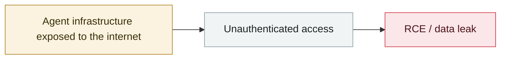

# Langflow CVE-2026-33017 used for Monero mining

     

## Summary

Trend Micro: unauthenticated RCE → `isp.sh` → a Go-based `lambsys` (placed at `/var/tmp/.xlamb`) that **walks private keys, known_hosts and ssh-agent keys to spread worm-style**, kills competing miners, disables AppArmor/SELinux/firewalls/the Alibaba Cloud monitoring agent, persists via cron and a resident script, and deploys a modified XMRig. **A single IoC traced 19 days of continuous exploitation**

## Attack chain

## Sources

| # | Source | Link |
|---|---|---|
| 1 | Trend Micro | <https://www.trendmicro.com/en_us/research/26/f/from-langflow-to-monero-inside-cve-2026-33017-cryptominer.html> |

## Metadata

| Field | Value |
|---|---|
| Date | `2026-06-28` (raw: 2026-06-28, precision `day`) |
| Kind | Vulnerability disclosure `vulnerability` |
| Type | [`INFRA`](../../taxonomy/types.md#infra) Agent infrastructure exposure |
| Severity | **High** `high` |
| Confidence | **A** — primary source (vendor / victim / law enforcement / official report) |
| Real harm | Yes |
| AI involvement | Confirmed `confirmed` |
| Region | [Global](../../regions/global.md) |
| Archive ID | `2026-06-28-langflow-yong-yu-men-luo` |

**Why this classification:** Vulnerability disclosure; in-the-wild exploitation is confirmed, so `real_harm: true`. Rated `high`: real damage is limited in scope, or it is a CVSS 9+ severe flaw, or a capability demonstration of significance. Grading criteria: see [taxonomy/severity.md](../../taxonomy/severity.md) and [taxonomy/confidence.md](../../taxonomy/confidence.md).

## Related

**Topic:** [Agent infrastructure exposure](../../topics/agent-infra.md)

**Related records:**

- `2026-06-08` [LiteLLM CVE-2026-42271 MCP endpoint takeover](2026-06-08-litellm-mcp-duan-dian-jie.md)   LiteLLM CVE-2026-42271 MCP endpoint takeover
- `2026-06-29` [DifyTap: four flaws leave 1M+ AI apps open to cross-tenant eavesdropping](2026-06-29-difytap-lou-dong-rang-wan.md)   DifyTap: four flaws leave 1M+ AI apps open to cross-tenant eavesdropping
- `2026-06-17` [Vertex AI SDK bucket takeover leads to cross-tenant RCE](2026-06-17-vertex-sdk-rce.md)   Vertex AI SDK bucket takeover leads to cross-tenant RCE
- `2026-06-18` [AutoJack: one web page from AutoGen Studio to the host](2026-06-18-autojack-autogen-studio.md)   AutoJack: one web page from AutoGen Studio to the host

---

[← 2026-06 index](README.md) · [← All records](../../README.md) · [Chinese](../i18n/zh/2026-06/2026-06-28-langflow-yong-yu-men-luo.md)

This record is part of the **Orca AI Incident Archive**, licensed [CC BY 4.0](../../LICENSE). Found a factual error or a missing source? [Open an issue or PR](../../CONTRIBUTING.md) — corrections are recorded in the record's revision history, never silently overwritten.
