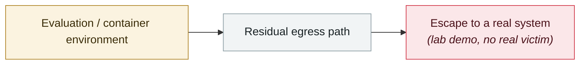

# GuardFall: 10 of 11 open-source agents can be pushed past their shell boundary

     

## Summary

Adversa: the root cause is that the guardrail compares against the **raw command string**, while bash performs quote removal, expansion and command substitution before execution — **the string that is checked and the command that actually runs are not the same thing**. Five bypass classes: `r''m`, `$IFS`, command substitution, piping base64 to sh, and `find -delete`. **Only Continue structurally blocks most of them in its default IDE mode**. ⚠️ Lab-verified, not in the wild; and it requires two preconditions: "indirect prompt injection makes the LLM misjudge" + "auto-execute mode is on or the sandbox is local"

## Attack chain

## Sources

| # | Source | Link |
|---|---|---|
| 1 | Adversa | <https://adversa.ai/blog/opensource-ai-coding-agents-shell-injection-vulnerability/> |

## Metadata

| Field | Value |
|---|---|
| Date | `2026-06-30` (raw: 2026-06-30, precision `day`) |
| Kind | Research demo `research` |
| Type | [`SANDBOX`](../../taxonomy/types.md#sandbox) Sandbox escape |
| Severity | **High** `high` |
| Confidence | **A** — primary source (vendor / victim / law enforcement / official report) |
| Real harm | No |
| AI involvement | Confirmed `confirmed` |
| Region | [Global](../../regions/global.md) |
| Archive ID | `2026-06-30-guardfall-agent-shell` |

**Why this classification:** Controlled demo by a research lab or vendor, `real_harm: false`; the record marks when the attack surface became public. Rated `high`: real damage is limited in scope, or it is a CVSS 9+ severe flaw, or a capability demonstration of significance. Grading criteria: see [taxonomy/severity.md](../../taxonomy/severity.md) and [taxonomy/confidence.md](../../taxonomy/confidence.md).

## Related

**Topic:** [Frontier model autonomous overreach](../../topics/eval-escapes.md)

**Related records:**

- `2026-05-08` [Cline Kanban cross-origin WebSocket hijack (CVE-2026-44211)](../2026-05/2026-05-08-cline-kanban-websocket.md)   Cline Kanban cross-origin WebSocket hijack (CVE-2026-44211)
- `2026-07-01` [DuneSlide: zero-click sandbox escape in Cursor](../2026-07/2026-07-01-duneslide-cursor-ling-dian-ji.md)   DuneSlide: zero-click sandbox escape in Cursor
- `2026-07-09` [GhostApproval: an approval bypass shared by six AI coding assistants](../2026-07/2026-07-09-ghostapproval-kuan-bian-ma-zhu.md)   GhostApproval: an approval bypass shared by six AI coding assistants
- `2026-07-01` [AWS Kiro: ask it to summarise a web page, get RCE (CVE-2026-10591)](../2026-07/2026-07-01-aws-kiro-rce.md)   AWS Kiro: ask it to summarise a web page, get RCE (CVE-2026-10591)

---

[← 2026-06 index](README.md) · [← All records](../../README.md) · [Chinese](../i18n/zh/2026-06/2026-06-30-guardfall-agent-shell.md)

This record is part of the **Orca AI Incident Archive**, licensed [CC BY 4.0](../../LICENSE). Found a factual error or a missing source? [Open an issue or PR](../../CONTRIBUTING.md) — corrections are recorded in the record's revision history, never silently overwritten.
