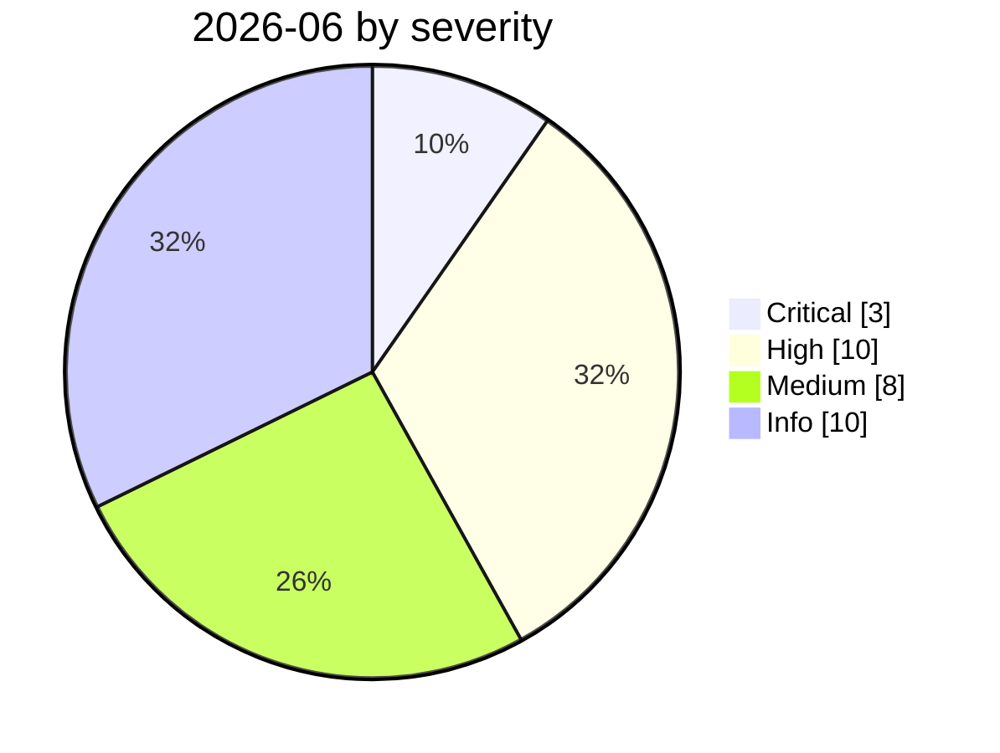

# 2026-06

<!-- BEGIN:summary -->
**31** records

    

## Records this month

| Date | Record | Type | Severity | Confidence | Real harm |
|---|---|---|---|---|---|
| `06-01` | ★ [Attackers simply ask Meta's AI support bot for Instagram accounts](2026-06-01-meta-ai-support-bot-hands-over-instagram.md) | `IPI` `CRED` | **Critical** | A | ✅ |
| `06-01` | ★ [Miasma worm](2026-06-01-miasma-worm.md) | `SUPPLY` `CRED` | **Critical** | A | ✅ |
| `06-02` | [CleverHans Lab adaptive AI worm PoC](2026-06-02-cleverhans-lab-poc.md) | `WEAPON` | Medium | A | — |
| `06-03` | [Anthropic, "LLM ATT&CK Navigator"](2026-06-03-anthropic-llm-att-ck.md) | `WEAPON` | Info | A | · |
| `06-04` | [Claude Oceanus-v1-p illegally redistributed](2026-06-04-claude-oceanus-fei-fa-fen.md) | `CRED` | **High** | B | ✅ |
| `06-04` | [Microsoft Scout launches, built on OpenClaw](2026-06-04-microsoft-scout-openclaw.md) | `OTHER` | Info | A | · |
| `06-08` | [LiteLLM CVE-2026-42271 MCP endpoint takeover](2026-06-08-litellm-mcp-duan-dian-jie.md) | `INFRA` | **High** | A | — |
| `06-08` | [AgentForger: one link forges an "AI insider"](2026-06-08-agentforger-yi-tiao-lian-jie.md) | `IPI` `CRED` | Medium | A | — |
| `06-09` | [Anthropic Claude Fable 5 GA, Mythos 5 limited release](2026-06-09-anthropic-claude-fable-ga.md) | `GOV` | Info | A | · |
| `06-09` | [Anthropic: N-day is really "N-hour"](2026-06-09-anthropic-day-hour.md) | `WEAPON` | Info | A | · |
| `06-11` | [CISA BOD 26-04](2026-06-11-cisa-bod.md) | `GOV` | Info | A | · |
| `06-12` | [Agentjacking: one public DSN hijacks AI coding agents](2026-06-12-agentjacking-public-dsn.md) | `MCP` `IPI` | **High** | A | — |
| `06-12` | [US government issues export controls to Anthropic](2026-06-12-anthropic-mei-guo-zheng-fu.md) | `GOV` | Info | A | · |
| `06-12` | [Google sues the China-linked "Outsider Enterprise" smishing network](2026-06-12-google-outsider-enterprise.md) | `GOV` | Info | A | · |
| `06-13` | [PromptSnatcher: ad-blocking extensions steal AI conversations](2026-06-13-promptsnatcher-guang-gao-lan-jie.md) | `CRED` | **High** | A | ✅ |
| `06-15` | [UNC6508 breaches North American research institutions via REDCap](2026-06-15-unc6508-redcap-jing-ru-qin.md) | `WEAPON` | **High** | A | ✅ |
| `06-15` | [Innocuous-looking GitHub repos make agents open a reverse shell](2026-06-15-github-agent-shell.md) | `SUPPLY` | Medium | A | — |
| `06-15` | [SearchLeak (CVE-2026-42824)](2026-06-15-searchleak.md) | `IPI` `EXFIL` | Medium | A | — |
| `06-17` | ★ [Sapphire Sleet poisons every Mastra AI scope in 88 minutes](2026-06-17-sapphire-sleet-mastra-88-minutes.md) | `SUPPLY` `CRED` | **Critical** | A | ✅ |
| `06-17` | [Vertex AI SDK bucket takeover leads to cross-tenant RCE](2026-06-17-vertex-sdk-rce.md) | `INFRA` | Medium | A | — |
| `06-18` | [ClickFix malvertising abuses claude.ai shared conversations](2026-06-18-clickfix-claude-ai-e-yi-guang.md) | `SUPPLY` | **High** | A | ✅ |
| `06-18` | [AutoJack: one web page from AutoGen Studio to the host](2026-06-18-autojack-autogen-studio.md) | `INFRA` | Medium | A | — |
| `06-19` | [Flaws in the SiderAI (10M) and MaxAI (1M) Chrome extensions](2026-06-19-siderai-maxai-chrome.md) | `CRED` | **High** | A | ✅ |
| `06-23` | [Five Eyes joint statement to boards and executives](2026-06-23-five-eyes-zhi-qi-ye.md) | `GOV` | Info | A | · |
| `06-24` | [BioShocking: dumb the agent down first, then take the password](2026-06-24-bioshocking-agent-xian-jiao-sha.md) | `IPI` `CRED` | Medium | A | — |
| `06-24` | [macOS.Gaslight: malware prompt-injects the AI analyst](2026-06-24-macos-gaslight-e-yi-ruan-jian.md) | `WEAPON` | Medium | A | — |
| `06-24` | [Operation Endgame (Europol) takes down StealC and Amadey](2026-06-24-operation-endgame-europol-stealc.md) | `GOV` | Info | A | · |
| `06-25` | [OpenAI GPT-5.6 Sol limited preview](2026-06-25-gpt-sol-xian-ding-yu.md) | `GOV` | Info | A | · |
| `06-28` | [Langflow CVE-2026-33017 used for Monero mining](2026-06-28-langflow-yong-yu-men-luo.md) | `INFRA` | **High** | A | ✅ |
| `06-29` | [DifyTap: four flaws leave 1M+ AI apps open to cross-tenant eavesdropping](2026-06-29-difytap-lou-dong-rang-wan.md) | `INFRA` | **High** | A | — |
| `06-30` | [GuardFall: 10 of 11 open-source agents can be pushed past their shell boundary](2026-06-30-guardfall-agent-shell.md) | `SANDBOX` | **High** | A | — |

★ = `critical` · ⚠️ = disputed facts or attribution · real harm: ✅ confirmed victim / — none / · not applicable (policy and intelligence reports)
<!-- END:summary -->

<!-- BEGIN:nav -->
---

[← 2026-05](../2026-05/README.md) · [Archive index](../../README.md) · [By type](../../taxonomy/types.md) · [2026-07 →](../2026-07/README.md)
<!-- END:nav -->
