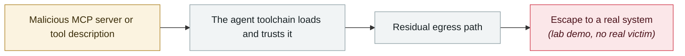

# AWS Kiro: ask it to summarise a web page, get RCE (CVE-2026-10591)

      

## Summary

Intezer and Kodem Security. When Kiro fetches or searches external content and hits a page with hidden instructions → the instructions make Kiro **use its own file-writing tool to write attacker content into `~/.kiro/settings/mcp.json`, with no user approval required** → Kiro reloads the config and launches that malicious MCP server → attacker code runs with the developer's privileges.

In the researchers' words: **"A request as ordinary as 'summarise this page for me' can end in remote code execution."** Fixed in 0.11.130

## Attack chain

## Sources

| # | Source | Link |
|---|---|---|
| 1 | THN | <https://thehackernews.com/2026/07/aws-kiro-flaw-let-poisoned-web-page.html> |
| 2 | Kodem | <https://www.kodemsecurity.com/resources/aws-kiro-agentic-ide-rce-prompt-injection-mcp-config-vulnerability> |

## Metadata

| Field | Value |
|---|---|
| Date | `2026-07-01` (raw: 2026-07, precision `month`) |
| Kind | Research demo `research` |
| Type | [`MCP`](../../taxonomy/types.md#mcp) MCP & tool-chain · [`SANDBOX`](../../taxonomy/types.md#sandbox) Sandbox escape |
| Severity | **High** `high` |
| Confidence | **A** — primary source (vendor / victim / law enforcement / official report) |
| Real harm | No |
| AI involvement | Confirmed `confirmed` |
| Region | [Global](../../regions/global.md) |
| Archive ID | `2026-07-01-aws-kiro-rce` |

**Why this classification:** Controlled demo by a research lab or vendor, `real_harm: false`; the record marks when the attack surface became public. Rated `high`: real damage is limited in scope, or it is a CVSS 9+ severe flaw, or a capability demonstration of significance. Grading criteria: see [taxonomy/severity.md](../../taxonomy/severity.md) and [taxonomy/confidence.md](../../taxonomy/confidence.md).

## Related

**Topic:** [Agent supply-chain poisoning](../../topics/agent-supply-chain.md) · [Frontier model autonomous overreach](../../topics/eval-escapes.md)

**Related records:**

- `2026-07-01` [DuneSlide: zero-click sandbox escape in Cursor](2026-07-01-duneslide-cursor-ling-dian-ji.md)   DuneSlide: zero-click sandbox escape in Cursor
- `2026-07-09` [GhostApproval: an approval bypass shared by six AI coding assistants](2026-07-09-ghostapproval-kuan-bian-ma-zhu.md)   GhostApproval: an approval bypass shared by six AI coding assistants
- `2026-07-30` [RufRoot (CVE-2026-59726): perfect CVSS, summons a rogue AI swarm](2026-07-30-rufroot-man-fen-zhao-huan.md)   RufRoot (CVE-2026-59726): perfect CVSS, summons a rogue AI swarm
- `2026-07-20` [Six sandbox escapes across four coding agents in one week](2026-07-20-agent-yi-nei-kuan-bian.md)   Six sandbox escapes across four coding agents in one week

---

[← 2026-07 index](README.md) · [← All records](../../README.md) · [Chinese](../i18n/zh/2026-07/2026-07-01-aws-kiro-rce.md)

This record is part of the **Orca AI Incident Archive**, licensed [CC BY 4.0](../../LICENSE). Found a factual error or a missing source? [Open an issue or PR](../../CONTRIBUTING.md) — corrections are recorded in the record's revision history, never silently overwritten.
