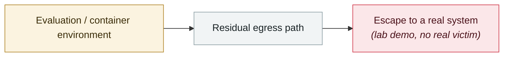

# DuneSlide: zero-click sandbox escape in Cursor

     

## Summary

Cato AI Labs, both CVEs at **CVSS 9.8**:

**CVE-2026-50548** abuses the optional `working_directory` parameter of the `run_terminal_cmd` tool — the sandbox lets the write command choose its working directory, and **the agent itself can set that directory without restriction**; prompt injection just has to point it at a system path outside the project

**CVE-2026-50549** is a flaw in the path-resolution **fallback logic**: before writing a file, Cursor resolves symlinks to confirm the real target is inside the project, but **when that check fails it trusts the path the symlink declares for itself** instead of blocking outright

CVEs assigned on 06-05, **fixed in Cursor 3.0 (released 04-02)**; everything before 3.0 is affected

⚠️ **CVE-2026-50549 shares its Cursor fix ID with Wiz's "GhostApproval" of 2026-07-09** — two teams independently found the same symlink flaw; **when ingesting, merge or tag `duplicate_of`, do not double-count**

## Attack chain

## Sources

| # | Source | Link |
|---|---|---|
| 1 | Cato Networks | <https://www.catonetworks.com/blog/duneslide-two-critical-rce-vulnerabilities/> |
| 2 | THN | <https://thehackernews.com/2026/07/critical-cursor-flaws-could-let-prompt.html> |
| 3 | SecurityWeek | <https://www.securityweek.com/critical-cursor-ai-ide-flaws-could-lead-to-os-level-remote-code-execution/> |

## Metadata

| Field | Value |
|---|---|
| Date | `2026-07-01` (raw: 2026-07-01, precision `day`) |
| Kind | Research demo `research` |
| Type | [`SANDBOX`](../../taxonomy/types.md#sandbox) Sandbox escape |
| Severity | **High** `high` |
| Confidence | **A** — primary source (vendor / victim / law enforcement / official report) |
| Real harm | No |
| AI involvement | Confirmed `confirmed` |
| Region | [Global](../../regions/global.md) |
| Archive ID | `2026-07-01-duneslide-cursor-ling-dian-ji` |

**Why this classification:** Controlled demo by a research lab or vendor, `real_harm: false`; the record marks when the attack surface became public. Rated `high`: real damage is limited in scope, or it is a CVSS 9+ severe flaw, or a capability demonstration of significance. Grading criteria: see [taxonomy/severity.md](../../taxonomy/severity.md) and [taxonomy/confidence.md](../../taxonomy/confidence.md).

## Related

**Topic:** [Frontier model autonomous overreach](../../topics/eval-escapes.md)

**Related records:**

- `2026-07-09` [GhostApproval: an approval bypass shared by six AI coding assistants](2026-07-09-ghostapproval-kuan-bian-ma-zhu.md)   GhostApproval: an approval bypass shared by six AI coding assistants
- `2026-07-01` [AWS Kiro: ask it to summarise a web page, get RCE (CVE-2026-10591)](2026-07-01-aws-kiro-rce.md)   AWS Kiro: ask it to summarise a web page, get RCE (CVE-2026-10591)
- `2026-07-20` [Six sandbox escapes across four coding agents in one week](2026-07-20-agent-yi-nei-kuan-bian.md)   Six sandbox escapes across four coding agents in one week
- `2026-07-22` [SharedRoot: Claude Cowork escapes a Linux VM onto the macOS host](2026-07-22-sharedroot-claude-cowork-linux.md)   SharedRoot: Claude Cowork escapes a Linux VM onto the macOS host

---

[← 2026-07 index](README.md) · [← All records](../../README.md) · [Chinese](../i18n/zh/2026-07/2026-07-01-duneslide-cursor-ling-dian-ji.md)

This record is part of the **Orca AI Incident Archive**, licensed [CC BY 4.0](../../LICENSE). Found a factual error or a missing source? [Open an issue or PR](../../CONTRIBUTING.md) — corrections are recorded in the record's revision history, never silently overwritten.
