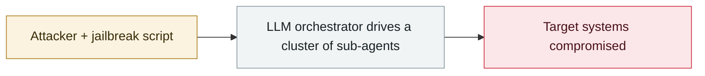

# JADEPUFFER: first ransomware driven end-to-end by an LLM

     

## Summary

Sysdig discloses JADEPUFFER: the first attack driven end-to-end by an LLM, from reconnaissance and lateral movement to encryption and extortion, with humans authorising only at key points.

## Attack chain

## Details

| Stage | Detail |
|---|---|
| Initial intrusion | Internet-exposed **Langflow** with missing authentication on the code-validation endpoint (**CVE-2025-3248**) → unauthenticated arbitrary Python execution |
| Reconnaissance | Enumerated hosts and hunted for LLM-provider API keys and cloud/database credentials; dumped Langflow's own Postgres; enumerated MinIO with default credentials to grab `credentials.json`; planted a cron calling out every 30 minutes |
| Actual target | A separate internet-facing server running **MySQL + Alibaba Nacos** |
| Success | root on MySQL; took over Nacos with the 2021 auth bypass **CVE-2021-29441** plus the default signing key, and injected a backdoor admin |
| Damage | Encrypted **1,342 Nacos configuration entries** with `AES_ENCRYPT()`, dropped the original and history tables, and left a ransom note |
| **Fatal detail** | **The key was randomly generated, shown once on standard output, and never saved or sent — paying the ransom would not restore anything** |
| Evidence it was AI-driven | ① Natural-language comments in the code explaining the reasoning for each step ② a precise correction within **31 seconds** of a failed login ③ 600+ consistent actions |

> This is the endgame form of the `WEAPON` category: **the attackers did not even check whether their own ransomware could decrypt**. AI industrialised the attack, and industrialised the sloppiness too.

## Sources

| # | Source | Link |
|---|---|---|
| 1 | Sysdig | <https://www.sysdig.com/blog/jadepuffer-agentic-ransomware-for-automated-database-extortion> |

## Metadata

| Field | Value |
|---|---|
| Date | `2026-07-01` (raw: 2026-07-01, precision `day`) |
| Kind | Incident `incident` |
| Type | [`WEAPON`](../../taxonomy/types.md#weapon) Agent used as a weapon |
| Severity | **Critical** `critical` |
| Confidence | **A** — primary source (vendor / victim / law enforcement / official report) |
| Real harm | Yes |
| AI involvement | Confirmed `confirmed` |
| Region | [Global](../../regions/global.md) |
| Archive ID | `2026-07-01-jadepuffer-first-llm-driven-ransomware` |

**Why this classification:** Real incident with a confirmed victim. Rated `critical`: confirmed real damage at the multi-organization / government / critical-infrastructure / supply-chain-worm level, or a first-of-its-kind capability milestone with real victims. Grading criteria: see [taxonomy/severity.md](../../taxonomy/severity.md) and [taxonomy/confidence.md](../../taxonomy/confidence.md).

## Related

**Topic:** [Offensive AI capability evolution](../../topics/offensive-ai.md)

**Related records:**

- `2026-07-01` [Taiwan's nuclear safety commission and other agencies breached by an agent swarm](2026-07-01-taiwan-government-agent-swarm.md)   Taiwan's nuclear safety commission and other agencies breached by an agent swarm
- `2026-07-09` [OpenAI's agents breach Hugging Face](2026-07-09-openai-agents-breach-huggingface.md)   OpenAI's agents breach Hugging Face
- `2026-07-30` [Hermes Agent attacks Thailand's Ministry of Finance unattended](2026-07-30-hermes-agent-thailand-finance-ministry.md)   Hermes Agent attacks Thailand's Ministry of Finance unattended
- `2026-07-30` [Unit 42: autonomous campaigns run by Chinese-speaking operators](2026-07-30-unit42-chinese-speaking-autonomous-campaigns.md)   Unit 42: autonomous campaigns run by Chinese-speaking operators

---

[← 2026-07 index](README.md) · [← All records](../../README.md) · [Chinese](../i18n/zh/2026-07/2026-07-01-jadepuffer-first-llm-driven-ransomware.md)

This record is part of the **Orca AI Incident Archive**, licensed [CC BY 4.0](../../LICENSE). Found a factual error or a missing source? [Open an issue or PR](../../CONTRIBUTING.md) — corrections are recorded in the record's revision history, never silently overwritten.
