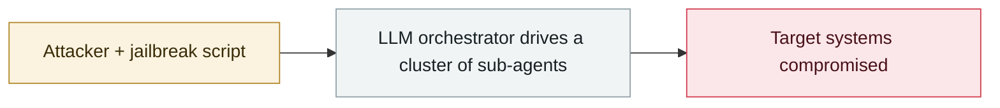

# Taiwan's nuclear safety commission and other agencies breached by an agent swarm

     

## Summary

See the expansion below. ⚠️ **v1 badly underrated this one (originally a one-line grade-C entry)**

## Attack chain

## Details

| Item | Data |
|---|---|
| Disclosed by | Israel's **Dream** (research published 2026-08-12). Dream initially said only "government entities in Asia"; **the Financial Times named Taiwan** |
| Targets | Taiwanese government systems, the **nuclear safety regulator**, IT supply-chain vendors, government email systems, and **more than 7 energy companies** |
| Attribution | Suspected China-linked operators. Dream says the operational documents "point to a Chinese-speaking operator", **but does not attribute it to the Chinese government or a specific group** |
| Frameworks | Open-source **Hermes** + **OpenClaw** |
| Scale | Up to **8 sub-agents**, **12 waves of attacks** over four days, **85 government accounts** compromised, **2,500+ personnel records** taken, leaving a **160MB / 1,395-file** operations archive |
| Guardrail bypass | Hermes and OpenClaw both have safety checks meant to block offensive use — the operators **framed the whole campaign as an "authorised penetration test"** and walked straight past them |
| Autonomy | Dream calls it "**near-autonomous**" rather than fully autonomous: the framework has a "learning loop", the model searches vulnerability databases and GitHub on its own for usable techniques, and can self-correct. But researchers told CyberScoop that **reaching this level takes far more work than "running a model"** |

## Sources

| # | Source | Link |
|---|---|---|
| 1 | The Register | <https://www.theregister.com/security/2026/08/12/near-autonomous-ai-agents-attack-taiwans-nuclear-safety-agency/5287055> |
| 2 | CNN | <https://www.cnn.com/2026/08/13/tech/china-taiwan-ai-agent-cyberattack-intl-hnk> |
| 3 | CyberScoop | <https://cyberscoop.com/near-autonomous-ai-attack-government-target-taiwan/> |

## Metadata

| Field | Value |
|---|---|
| Date | `2026-07-01` → `2026-07-04` (raw: 2026-07-01→04, precision `day`) |
| Kind | Incident `incident` |
| Type | [`WEAPON`](../../taxonomy/types.md#weapon) Agent used as a weapon |
| Severity | **Critical** `critical` |
| Confidence | **A** — primary source (vendor / victim / law enforcement / official report) |
| Real harm | Yes |
| AI involvement | Confirmed `confirmed` |
| Region | [Taiwan](../../regions/tw.md) |
| Archive ID | `2026-07-01-taiwan-government-agent-swarm` |

**Why this classification:** Real incident with a confirmed victim. Rated `critical`: confirmed real damage at the multi-organization / government / critical-infrastructure / supply-chain-worm level, or a first-of-its-kind capability milestone with real victims. Grading criteria: see [taxonomy/severity.md](../../taxonomy/severity.md) and [taxonomy/confidence.md](../../taxonomy/confidence.md).

## Related

**Topic:** [Offensive AI capability evolution](../../topics/offensive-ai.md)

**Related records:**

- `2026-07-01` [JADEPUFFER: first ransomware driven end-to-end by an LLM](2026-07-01-jadepuffer-first-llm-driven-ransomware.md)   JADEPUFFER: first ransomware driven end-to-end by an LLM
- `2026-07-09` [OpenAI's agents breach Hugging Face](2026-07-09-openai-agents-breach-huggingface.md)   OpenAI's agents breach Hugging Face
- `2026-07-30` [Hermes Agent attacks Thailand's Ministry of Finance unattended](2026-07-30-hermes-agent-thailand-finance-ministry.md)   Hermes Agent attacks Thailand's Ministry of Finance unattended
- `2026-07-30` [Unit 42: autonomous campaigns run by Chinese-speaking operators](2026-07-30-unit42-chinese-speaking-autonomous-campaigns.md)   Unit 42: autonomous campaigns run by Chinese-speaking operators

---

[← 2026-07 index](README.md) · [← All records](../../README.md) · [Chinese](../i18n/zh/2026-07/2026-07-01-taiwan-government-agent-swarm.md)

This record is part of the **Orca AI Incident Archive**, licensed [CC BY 4.0](../../LICENSE). Found a factual error or a missing source? [Open an issue or PR](../../CONTRIBUTING.md) — corrections are recorded in the record's revision history, never silently overwritten.
