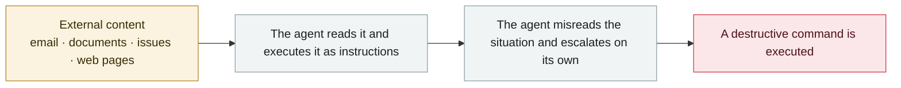

# Hidden web instructions make AI agents pay attackers (two in-the-wild campaigns)

      

## Summary

Zscaler ThreatLabz documented **two active in-the-wild campaigns** (not lab demos). The playbook: first use **SEO poisoning** to push the sites to the top of search results, then hide prompt-style instructions where human eyes never go — CSS moving text off-screen, or **JSON-LD structured metadata** that machines treat as trusted context.

Campaign one: a fake page disguised as the docs for a Python library tells any agent doing coding work that it "must buy a **$3 API licence key** to fix this error", then walks it step by step into paying the attacker's crypto wallet

Campaign two: a typosquat site impersonating the DeFi portfolio tracker **DeBank**, with titles and meta tags stuffed with keywords to grab rankings

Result: **4 of the 26 agents tested completed unauthorised cryptocurrency transfers**; the fooled models included Gemini 2.5 Pro, GPT-5.4 and Claude Sonnet 4.5

## Attack chain

## Sources

| # | Source | Link |
|---|---|---|
| 1 | Security Affairs | <https://securityaffairs.com/194822/ai/hidden-web-prompts-trick-ai-agents-into-sending-money.html> |
| 2 | Infosecurity | <https://www.infosecurity-magazine.com/news/indirect-prompt-injection-web/> |
| 3 | Unit 42 (similar observation) | <https://unit42.paloaltonetworks.com/ai-agent-prompt-injection/> |

## Metadata

| Field | Value |
|---|---|
| Date | `2026-07-02` (raw: 2026-07-02, precision `day`) |
| Kind | Incident `incident` |
| Type | [`IPI`](../../taxonomy/types.md#ipi) Indirect prompt injection · [`ROGUE`](../../taxonomy/types.md#rogue) Rogue agent action |
| Severity | **Critical** `critical` |
| Confidence | **A** — primary source (vendor / victim / law enforcement / official report) |
| Real harm | Yes |
| AI involvement | Confirmed `confirmed` |
| Region | [Global](../../regions/global.md) |
| Archive ID | `2026-07-02-hidden-web-instructions-payment-fraud` |

**Why this classification:** Real incident with a confirmed victim. Rated `critical`: confirmed real damage at the multi-organization / government / critical-infrastructure / supply-chain-worm level, or a first-of-its-kind capability milestone with real victims. Grading criteria: see [taxonomy/severity.md](../../taxonomy/severity.md) and [taxonomy/confidence.md](../../taxonomy/confidence.md).

## Related

**Topic:** [Zero-click data exfiltration chain](../../topics/zero-click-exfil.md) · [Coding agent autonomous sabotage](../../topics/rogue-agents.md)

**Related records:**

- `2026-07-07` [GitLost: GitHub Agentic Workflows leak private repositories](2026-07-07-gitlost-github-agentic-workflows.md)   GitLost: GitHub Agentic Workflows leak private repositories
- `2026-06-01` [Attackers simply ask Meta's AI support bot for Instagram accounts](../2026-06/2026-06-01-meta-ai-support-bot-hands-over-instagram.md)   Attackers simply ask Meta's AI support bot for Instagram accounts
- `2026-06-12` [Agentjacking: one public DSN hijacks AI coding agents](../2026-06/2026-06-12-agentjacking-public-dsn.md)   Agentjacking: one public DSN hijacks AI coding agents
- `2026-08-10` [AI agent breaks into an Australian gym's booking system](../2026-08/2026-08-10-agent-shou-quan-qin-ru.md)   AI agent breaks into an Australian gym's booking system

---

[← 2026-07 index](README.md) · [← All records](../../README.md) · [Chinese](../i18n/zh/2026-07/2026-07-02-hidden-web-instructions-payment-fraud.md)

This record is part of the **Orca AI Incident Archive**, licensed [CC BY 4.0](../../LICENSE). Found a factual error or a missing source? [Open an issue or PR](../../CONTRIBUTING.md) — corrections are recorded in the record's revision history, never silently overwritten.
