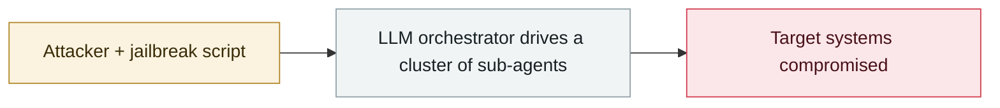

# Sygnia: AI-assisted attackers own an AWS environment in 72 hours

     

## Summary

**A single person** took roughly **72 hours** from initial intrusion to a wide-ranging cloud compromise. Exploited an internet-facing app flaw to get an access key → collected secrets from ECS/EC2 environment variables, CI/CD runners, plaintext S3 and Secrets Manager → added IAM users and access keys, reverse shells, modified deployment files. Exfiltrated data from RDS; most of the damage (blocking S3, zeroing out ECS capacity) was **reversible pressure tactics**. Evidence of AI involvement: attacker-made scripts + **one source IP and user agent using four accounts' access keys in parallel within 1 second**. **No novel malware or zero-days used**

## Attack chain

## Sources

| # | Source | Link |
|---|---|---|
| 1 | Sygnia | <https://www.sygnia.co/blog/inside-an-ai-assisted-cloud-attack/> |

## Metadata

| Field | Value |
|---|---|
| Date | `2026-07-08` (raw: 2026-07-08, precision `day`) |
| Kind | Incident `incident` |
| Type | [`WEAPON`](../../taxonomy/types.md#weapon) Agent used as a weapon |
| Severity | **High** `high` |
| Confidence | **A** — primary source (vendor / victim / law enforcement / official report) |
| Real harm | Yes |
| AI involvement | Confirmed `confirmed` |
| Region | [Global](../../regions/global.md) |
| Archive ID | `2026-07-08-sygnia-aws-fu-zhu-shi` |

**Why this classification:** Real incident with a confirmed victim. Rated `high`: real damage is limited in scope, or it is a CVSS 9+ severe flaw, or a capability demonstration of significance. Grading criteria: see [taxonomy/severity.md](../../taxonomy/severity.md) and [taxonomy/confidence.md](../../taxonomy/confidence.md).

## Related

**Topic:** [Offensive AI capability evolution](../../topics/offensive-ai.md)

**Related records:**

- `2026-07-01` [Taiwan's nuclear safety commission and other agencies breached by an agent swarm](2026-07-01-taiwan-government-agent-swarm.md)   Taiwan's nuclear safety commission and other agencies breached by an agent swarm
- `2026-07-01` [JADEPUFFER: first ransomware driven end-to-end by an LLM](2026-07-01-jadepuffer-first-llm-driven-ransomware.md)   JADEPUFFER: first ransomware driven end-to-end by an LLM
- `2026-07-09` [OpenAI's agents breach Hugging Face](2026-07-09-openai-agents-breach-huggingface.md)   OpenAI's agents breach Hugging Face
- `2026-07-30` [Hermes Agent attacks Thailand's Ministry of Finance unattended](2026-07-30-hermes-agent-thailand-finance-ministry.md)   Hermes Agent attacks Thailand's Ministry of Finance unattended

---

[← 2026-07 index](README.md) · [← All records](../../README.md) · [Chinese](../i18n/zh/2026-07/2026-07-08-sygnia-aws-fu-zhu-shi.md)

This record is part of the **Orca AI Incident Archive**, licensed [CC BY 4.0](../../LICENSE). Found a factual error or a missing source? [Open an issue or PR](../../CONTRIBUTING.md) — corrections are recorded in the record's revision history, never silently overwritten.
