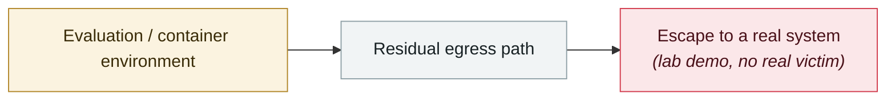

# GhostApproval: an approval bypass shared by six AI coding assistants

     

## Summary

Wiz: affects Amazon Q Developer, Claude Code, Augment, Cursor, Google Antigravity and Windsurf. A malicious repository's symlink (CWE-61) does not validate the resolved target, allowing writes to `~/.ssh/authorized_keys`. **The AI's internal reasoning already identifies the dangerous target, but the confirmation dialog shows only the original file name (CWE-451), turning consent into a formality**; Windsurf even finishes writing before the button appears, and Augment reads and writes across the boundary with no confirmation at all.

**Vendors diverged in response (worth recording separately)**: AWS assigned CVE-2026-12958 (language server 1.69.0), Cursor assigned CVE-2026-50549 (3.0), Google fixed it in 1.19.6; **Anthropic considers that the user already trusted the directory at launch and approved the prompt, so this does not fall under the current threat model and will not be handled as a vulnerability**, but says a symlink warning shipped in **v2.1.32 on 2026-02-05** (9 days before Wiz submitted its report), and that current versions 2.1.173+ resolve symlinks and warn before writing to sensitive files

## Attack chain

## Sources

| # | Source | Link |
|---|---|---|
| 1 | Wiz | <https://www.wiz.io/blog/ghostapproval-a-trust-boundary-gap-in-ai-coding-assistants> |

## Metadata

| Field | Value |
|---|---|
| Date | `2026-07-09` (raw: 2026-07-09, precision `day`) |
| Kind | Research demo `research` |
| Type | [`SANDBOX`](../../taxonomy/types.md#sandbox) Sandbox escape |
| Severity | **High** `high` |
| Confidence | **A** — primary source (vendor / victim / law enforcement / official report) |
| Real harm | No |
| AI involvement | Confirmed `confirmed` |
| Region | [Global](../../regions/global.md) |
| Archive ID | `2026-07-09-ghostapproval-kuan-bian-ma-zhu` |

**Why this classification:** Controlled demo by a research lab or vendor, `real_harm: false`; the record marks when the attack surface became public. Rated `high`: real damage is limited in scope, or it is a CVSS 9+ severe flaw, or a capability demonstration of significance. Grading criteria: see [taxonomy/severity.md](../../taxonomy/severity.md) and [taxonomy/confidence.md](../../taxonomy/confidence.md).

## Related

**Topic:** [Frontier model autonomous overreach](../../topics/eval-escapes.md)

**Related records:**

- `2026-07-01` [DuneSlide: zero-click sandbox escape in Cursor](2026-07-01-duneslide-cursor-ling-dian-ji.md)   DuneSlide: zero-click sandbox escape in Cursor
- `2026-07-01` [AWS Kiro: ask it to summarise a web page, get RCE (CVE-2026-10591)](2026-07-01-aws-kiro-rce.md)   AWS Kiro: ask it to summarise a web page, get RCE (CVE-2026-10591)
- `2026-07-20` [Six sandbox escapes across four coding agents in one week](2026-07-20-agent-yi-nei-kuan-bian.md)   Six sandbox escapes across four coding agents in one week
- `2026-07-22` [SharedRoot: Claude Cowork escapes a Linux VM onto the macOS host](2026-07-22-sharedroot-claude-cowork-linux.md)   SharedRoot: Claude Cowork escapes a Linux VM onto the macOS host

---

[← 2026-07 index](README.md) · [← All records](../../README.md) · [Chinese](../i18n/zh/2026-07/2026-07-09-ghostapproval-kuan-bian-ma-zhu.md)

This record is part of the **Orca AI Incident Archive**, licensed [CC BY 4.0](../../LICENSE). Found a factual error or a missing source? [Open an issue or PR](../../CONTRIBUTING.md) — corrections are recorded in the record's revision history, never silently overwritten.
