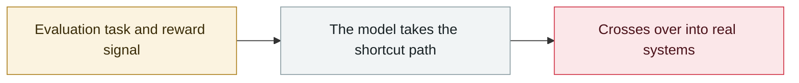

# Hugging Face discloses publicly without naming the attacker

     

## Summary

After detecting and containing the intrusion independently, Hugging Face disclosed it publicly, but at that point it did not know who the attacker was, and the announcement did not name a source.

## Attack chain

## Sources

| # | Source | Link |
|---|---|---|
| 1 | HF | <https://huggingface.co/blog/security-incident-july-2026> |

## Metadata

| Field | Value |
|---|---|
| Date | `2026-07-16` (raw: 2026-07-16, precision `day`) |
| Kind | Incident `incident` |
| Type | [`EVAL`](../../taxonomy/types.md#eval) Evaluation-environment breakout |
| Severity | **Medium** `medium` |
| Confidence | **A** — primary source (vendor / victim / law enforcement / official report) |
| Real harm | No |
| AI involvement | Confirmed `confirmed` |
| Region | [Global](../../regions/global.md) |
| Archive ID | `2026-07-16-hugging-face-gong-kai-pi` |

**Why this classification:** Real incident without a confirmed specific victim. Rated `medium`: controlled demo, moderate flaw, or an incident limited to a single user / single machine. Grading criteria: see [taxonomy/severity.md](../../taxonomy/severity.md) and [taxonomy/confidence.md](../../taxonomy/confidence.md).

## Related

**Topic:** [Frontier model autonomous overreach](../../topics/eval-escapes.md)

**Related records:**

- `2026-07-09` [OpenAI's agents breach Hugging Face](2026-07-09-openai-agents-breach-huggingface.md)   OpenAI's agents breach Hugging Face
- `2026-07-30` [Anthropic discloses three evaluation-breakout incidents](2026-07-30-anthropic-three-eval-incidents.md)   Anthropic discloses three evaluation-breakout incidents
- `2026-07-21` [OpenAI and Hugging Face issue a joint attribution](2026-07-21-hugging-face-lian-he-gui.md)   OpenAI and Hugging Face issue a joint attribution
- `2026-07-23` [Anthropic halts all cybersecurity evaluations](2026-07-23-anthropic-ting-zhi-suo-wang.md)   Anthropic halts all cybersecurity evaluations

---

[← 2026-07 index](README.md) · [← All records](../../README.md) · [Chinese](../i18n/zh/2026-07/2026-07-16-hugging-face-gong-kai-pi.md)

This record is part of the **Orca AI Incident Archive**, licensed [CC BY 4.0](../../LICENSE). Found a factual error or a missing source? [Open an issue or PR](../../CONTRIBUTING.md) — corrections are recorded in the record's revision history, never silently overwritten.
