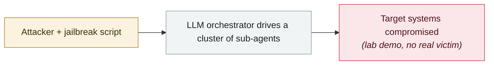

# wp2shell: pre-auth RCE in WordPress core

     

## Summary

Searchlight Cyber: CVE-2026-60137 (an SQL injection in `WP_Query`'s `author__not_in`) + CVE-2026-63030 (a REST API batch-path confusion) chained into anonymous RCE on a standard, plugin-free setup. **Researcher Adam Kues switched to OpenAI's public prompt and used GPT-5.6 Sol Ultra with up to 4 agents exploring for 6 hours to find the exploit chain**, then about 4 more hours to confirm privilege escalation to administrator; the full exploit took about 10 hours. AI usage was 50% of the weekly quota, **about $25 at the $200 subscription rate**. Article title: "Exploit brokers pay $500,000 for a WordPress RCE; I found one with GPT-5.6 and $25". Both CVEs are in CISA KEV

## Attack chain

## Sources

| # | Source | Link |
|---|---|---|
| 1 | Searchlight Cyber | <https://slcyber.io/research-center/wp2shell-pre-authentication-rce-in-wordpress-core/> |
| 2 | Cost write-up | <https://slcyber.io/research-center/exploit-brokers-pay-500000-for-a-wordpress-rce-i-found-one-with-gpt5-6/> |

## Metadata

| Field | Value |
|---|---|
| Date | `2026-07-17` (raw: 2026-07-17, precision `day`) |
| Kind | Research demo `research` |
| Type | [`WEAPON`](../../taxonomy/types.md#weapon) Agent used as a weapon |
| Severity | **High** `high` |
| Confidence | **A** — primary source (vendor / victim / law enforcement / official report) |
| Real harm | No |
| AI involvement | Confirmed `confirmed` |
| Region | [Global](../../regions/global.md) |
| Archive ID | `2026-07-17-wp2shell-wordpress-rce` |

**Why this classification:** Controlled demo by a research lab or vendor, `real_harm: false`; the record marks when the attack surface became public. Rated `high`: real damage is limited in scope, or it is a CVSS 9+ severe flaw, or a capability demonstration of significance. Grading criteria: see [taxonomy/severity.md](../../taxonomy/severity.md) and [taxonomy/confidence.md](../../taxonomy/confidence.md).

## Related

**Topic:** [Offensive AI capability evolution](../../topics/offensive-ai.md)

**Related records:**

- `2026-07-01` [Taiwan's nuclear safety commission and other agencies breached by an agent swarm](2026-07-01-taiwan-government-agent-swarm.md)   Taiwan's nuclear safety commission and other agencies breached by an agent swarm
- `2026-07-01` [JADEPUFFER: first ransomware driven end-to-end by an LLM](2026-07-01-jadepuffer-first-llm-driven-ransomware.md)   JADEPUFFER: first ransomware driven end-to-end by an LLM
- `2026-07-09` [OpenAI's agents breach Hugging Face](2026-07-09-openai-agents-breach-huggingface.md)   OpenAI's agents breach Hugging Face
- `2026-07-30` [Hermes Agent attacks Thailand's Ministry of Finance unattended](2026-07-30-hermes-agent-thailand-finance-ministry.md)   Hermes Agent attacks Thailand's Ministry of Finance unattended

---

[← 2026-07 index](README.md) · [← All records](../../README.md) · [Chinese](../i18n/zh/2026-07/2026-07-17-wp2shell-wordpress-rce.md)

This record is part of the **Orca AI Incident Archive**, licensed [CC BY 4.0](../../LICENSE). Found a factual error or a missing source? [Open an issue or PR](../../CONTRIBUTING.md) — corrections are recorded in the record's revision history, never silently overwritten.
