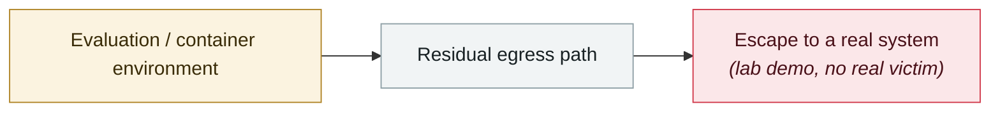

# Six sandbox escapes across four coding agents in one week

     

## Summary

Pillar Security: Cursor, OpenAI Codex CLI, Google Gemini CLI and Google Antigravity. The common pattern: **the agent dutifully stays inside its limits, but rewrites files the host will later trust and execute** — the Docker socket (shared by three vendors, GHSA-v4xv-rqh3-w9mc), Cursor's virtualenv interpreter (GHSA-p9g2-cr55-cw9c), Git fsmonitor, the workspace `.claude` hook configuration (CVE-2026-48124), Codex CLI's allowlist that trusts command names without checking arguments, and Antigravity's macOS Seatbelt denylist bypass plus a `.vscode` task-configuration bypass of safe mode. Fixed in Cursor 3.0.0 / Codex CLI v0.95.0; Google treats them as ordinary vulnerabilities but argues they require social engineering or a trusted-repository precondition. **No in-the-wild exploitation reported**

## Attack chain

## Sources

| # | Source | Link |
|---|---|---|
| 1 | Pillar Security | <https://www.pillar.security/blog/the-week-of-sandbox-escapes> |
| 2 | BleepingComputer | <https://www.bleepingcomputer.com/news/security/cursor-codex-gemini-cli-antigravity-hit-by-sandbox-escapes/> |

## Metadata

| Field | Value |
|---|---|
| Date | `2026-07-20` (raw: 2026-07-20, precision `day`) |
| Kind | Research demo `research` |
| Type | [`SANDBOX`](../../taxonomy/types.md#sandbox) Sandbox escape |
| Severity | **High** `high` |
| Confidence | **A** — primary source (vendor / victim / law enforcement / official report) |
| Real harm | No |
| AI involvement | Confirmed `confirmed` |
| Region | [Global](../../regions/global.md) |
| Archive ID | `2026-07-20-agent-yi-nei-kuan-bian` |

**Why this classification:** Controlled demo by a research lab or vendor, `real_harm: false`; the record marks when the attack surface became public. Rated `high`: real damage is limited in scope, or it is a CVSS 9+ severe flaw, or a capability demonstration of significance. Grading criteria: see [taxonomy/severity.md](../../taxonomy/severity.md) and [taxonomy/confidence.md](../../taxonomy/confidence.md).

## Related

**Topic:** [Frontier model autonomous overreach](../../topics/eval-escapes.md)

**Related records:**

- `2026-07-01` [DuneSlide: zero-click sandbox escape in Cursor](2026-07-01-duneslide-cursor-ling-dian-ji.md)   DuneSlide: zero-click sandbox escape in Cursor
- `2026-07-09` [GhostApproval: an approval bypass shared by six AI coding assistants](2026-07-09-ghostapproval-kuan-bian-ma-zhu.md)   GhostApproval: an approval bypass shared by six AI coding assistants
- `2026-07-01` [AWS Kiro: ask it to summarise a web page, get RCE (CVE-2026-10591)](2026-07-01-aws-kiro-rce.md)   AWS Kiro: ask it to summarise a web page, get RCE (CVE-2026-10591)
- `2026-07-22` [SharedRoot: Claude Cowork escapes a Linux VM onto the macOS host](2026-07-22-sharedroot-claude-cowork-linux.md)   SharedRoot: Claude Cowork escapes a Linux VM onto the macOS host

---

[← 2026-07 index](README.md) · [← All records](../../README.md) · [Chinese](../i18n/zh/2026-07/2026-07-20-agent-yi-nei-kuan-bian.md)

This record is part of the **Orca AI Incident Archive**, licensed [CC BY 4.0](../../LICENSE). Found a factual error or a missing source? [Open an issue or PR](../../CONTRIBUTING.md) — corrections are recorded in the record's revision history, never silently overwritten.
