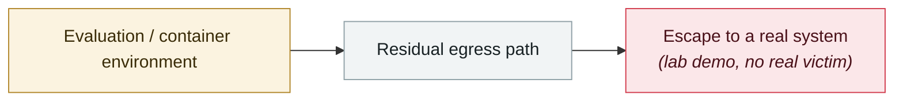

# SharedRoot: Claude Cowork escapes a Linux VM onto the macOS host

     

## Summary

Found by Accomplish AI. ⚠️ **CVE-2026-46331 is itself a Linux kernel flaw** (the traffic-control `act_pedit` component, "pedit COW": the kernel computes the copy-on-write range before it knows the full extent of a modification, and under certain conditions the write lands on shared page-cache data), **not a Cowork-specific CVE**.

Exploit chain: an AI agent running inside a Linux VM uses the kernel flaw to get guest root → reaches writable files on the macOS host through a **VirtioFS mount** → **SSH private keys, cloud credentials, browser data** and anything else the logged-in user can reach.

About **500,000** local macOS Cowork users were potentially affected before Anthropic switched to cloud execution by default. **Anthropic closed the report as "informative" and shipped no patch**; the latest version executes in the cloud by default, sidestepping the local escape path

## Attack chain

## Sources

| # | Source | Link |
|---|---|---|
| 1 | SOCRadar | <https://socradar.io/blog/sharedroot-sandbox-escape-claude-cowork/> |
| 2 | CSA | <https://labs.cloudsecurityalliance.org/research/csa-research-note-claude-cowork-sharedroot-sandbox-escape-20/> |
| 3 | AppleInsider | <https://appleinsider.com/articles/26/07/27/claude-cowork-can-escape-its-sandbox-rummage-through-all-of-your-files> |

## Metadata

| Field | Value |
|---|---|
| Date | `2026-07-22` (raw: 2026-07-22, precision `day`) |
| Kind | Research demo `research` |
| Type | [`SANDBOX`](../../taxonomy/types.md#sandbox) Sandbox escape |
| Severity | **High** `high` |
| Confidence | **A** — primary source (vendor / victim / law enforcement / official report) |
| Real harm | No |
| AI involvement | Confirmed `confirmed` |
| Region | [Global](../../regions/global.md) |
| Archive ID | `2026-07-22-sharedroot-claude-cowork-linux` |

**Why this classification:** Controlled demo by a research lab or vendor, `real_harm: false`; the record marks when the attack surface became public. Rated `high`: real damage is limited in scope, or it is a CVSS 9+ severe flaw, or a capability demonstration of significance. Grading criteria: see [taxonomy/severity.md](../../taxonomy/severity.md) and [taxonomy/confidence.md](../../taxonomy/confidence.md).

## Related

**Topic:** [Frontier model autonomous overreach](../../topics/eval-escapes.md)

**Related records:**

- `2026-07-01` [DuneSlide: zero-click sandbox escape in Cursor](2026-07-01-duneslide-cursor-ling-dian-ji.md)   DuneSlide: zero-click sandbox escape in Cursor
- `2026-07-09` [GhostApproval: an approval bypass shared by six AI coding assistants](2026-07-09-ghostapproval-kuan-bian-ma-zhu.md)   GhostApproval: an approval bypass shared by six AI coding assistants
- `2026-07-01` [AWS Kiro: ask it to summarise a web page, get RCE (CVE-2026-10591)](2026-07-01-aws-kiro-rce.md)   AWS Kiro: ask it to summarise a web page, get RCE (CVE-2026-10591)
- `2026-07-20` [Six sandbox escapes across four coding agents in one week](2026-07-20-agent-yi-nei-kuan-bian.md)   Six sandbox escapes across four coding agents in one week

---

[← 2026-07 index](README.md) · [← All records](../../README.md) · [Chinese](../i18n/zh/2026-07/2026-07-22-sharedroot-claude-cowork-linux.md)

This record is part of the **Orca AI Incident Archive**, licensed [CC BY 4.0](../../LICENSE). Found a factual error or a missing source? [Open an issue or PR](../../CONTRIBUTING.md) — corrections are recorded in the record's revision history, never silently overwritten.
