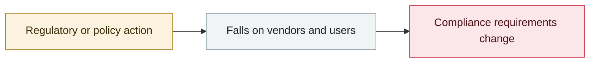

# Anthropic halts all cybersecurity evaluations

     

## Summary

On the day it launched an internal review, Anthropic announced a pause on all cybersecurity evaluation runs until the isolation measures are rebuilt.

## Attack chain

## Sources

| # | Source | Link |
|---|---|---|
| 1 | Anthropic | <https://www.anthropic.com/news/investigating-incidents-cybersecurity-evals> |

## Metadata

| Field | Value |
|---|---|
| Date | `2026-07-23` (raw: 2026-07-23, precision `day`) |
| Kind | Policy & regulation `policy` |
| Type | [`EVAL`](../../taxonomy/types.md#eval) Evaluation-environment breakout |
| Severity | **Info** `info` |
| Confidence | **A** — primary source (vendor / victim / law enforcement / official report) |
| Real harm | n/a |
| AI involvement | Confirmed `confirmed` |
| Region | [Global](../../regions/global.md) |
| Archive ID | `2026-07-23-anthropic-ting-zhi-suo-wang` |

**Why this classification:** Policy / regulatory action, not counted in incident statistics; `severity` is recorded as `info`. Grading criteria: see [taxonomy/severity.md](../../taxonomy/severity.md) and [taxonomy/confidence.md](../../taxonomy/confidence.md).

## Related

**Topic:** [Frontier model autonomous overreach](../../topics/eval-escapes.md)

**Related records:**

- `2026-07-09` [OpenAI's agents breach Hugging Face](2026-07-09-openai-agents-breach-huggingface.md)   OpenAI's agents breach Hugging Face
- `2026-07-30` [Anthropic discloses three evaluation-breakout incidents](2026-07-30-anthropic-three-eval-incidents.md)   Anthropic discloses three evaluation-breakout incidents
- `2026-07-16` [Hugging Face discloses publicly without naming the attacker](2026-07-16-hugging-face-gong-kai-pi.md)   Hugging Face discloses publicly without naming the attacker
- `2026-07-21` [OpenAI and Hugging Face issue a joint attribution](2026-07-21-hugging-face-lian-he-gui.md)   OpenAI and Hugging Face issue a joint attribution

---

[← 2026-07 index](README.md) · [← All records](../../README.md) · [Chinese](../i18n/zh/2026-07/2026-07-23-anthropic-ting-zhi-suo-wang.md)

This record is part of the **Orca AI Incident Archive**, licensed [CC BY 4.0](../../LICENSE). Found a factual error or a missing source? [Open an issue or PR](../../CONTRIBUTING.md) — corrections are recorded in the record's revision history, never silently overwritten.
