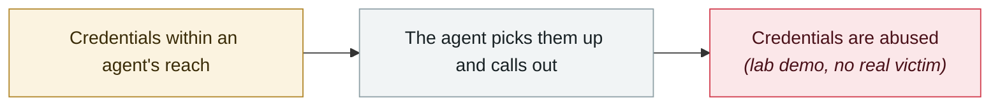

# Elastic: coding-agent tunnel traffic looks almost exactly like C2 beacons

     

## Summary

Elastic Security Labs, reviewing endpoint telemetry from 2026-07, saw two independent hunting paths hit the same host on 07-23: **agent-spawned reverse tunnels** (localhost.run / lhr.life, Cloudflare Quick Tunnels, ngrok), **macOS LaunchAgent persistence**, and credentialed HTTP egress — all within the same session window.

A structural problem: **agentic coding tools inherently combine "everything an attacker needs access to" (private environment variables, credentials, API keys, local config) with "continuous ingestion of untrusted content" (repositories, documents, error messages)**. Elastic's advice is concrete: **do not automatically close this class of alert just because a coding agent appears in the process tree**

## Attack chain

## Sources

| # | Source | Link |
|---|---|---|
| 1 | Elastic Security Labs | <https://www.elastic.co/security-labs/coding-agent-launchagent-tunnel-detection> |

## Metadata

| Field | Value |
|---|---|
| Date | `2026-07-23` (raw: 2026-07-23, precision `day`) |
| Kind | Research demo `research` |
| Type | [`CRED`](../../taxonomy/types.md#cred) Credential abuse |
| Severity | **Medium** `medium` |
| Confidence | **A** — primary source (vendor / victim / law enforcement / official report) |
| Real harm | No |
| AI involvement | Confirmed `confirmed` |
| Region | [Global](../../regions/global.md) |
| Archive ID | `2026-07-23-elastic-coding-agent-c2` |

**Why this classification:** Controlled demo by a research lab or vendor, `real_harm: false`; the record marks when the attack surface became public. Rated `medium`: controlled demo, moderate flaw, or an incident limited to a single user / single machine. Grading criteria: see [taxonomy/severity.md](../../taxonomy/severity.md) and [taxonomy/confidence.md](../../taxonomy/confidence.md).

## Related

**Related records:**

- `2026-06-01` [Miasma worm](../2026-06/2026-06-01-miasma-worm.md)   Miasma worm
- `2026-06-01` [Attackers simply ask Meta's AI support bot for Instagram accounts](../2026-06/2026-06-01-meta-ai-support-bot-hands-over-instagram.md)   Attackers simply ask Meta's AI support bot for Instagram accounts
- `2026-06-17` [Sapphire Sleet poisons every Mastra AI scope in 88 minutes](../2026-06/2026-06-17-sapphire-sleet-mastra-88-minutes.md)   Sapphire Sleet poisons every Mastra AI scope in 88 minutes
- `2026-08-04` [CHAINDROP npm worm](../2026-08/2026-08-04-chaindrop-npm-ru-chong.md)   CHAINDROP npm worm

---

[← 2026-07 index](README.md) · [← All records](../../README.md) · [Chinese](../i18n/zh/2026-07/2026-07-23-elastic-coding-agent-c2.md)

This record is part of the **Orca AI Incident Archive**, licensed [CC BY 4.0](../../LICENSE). Found a factual error or a missing source? [Open an issue or PR](../../CONTRIBUTING.md) — corrections are recorded in the record's revision history, never silently overwritten.
