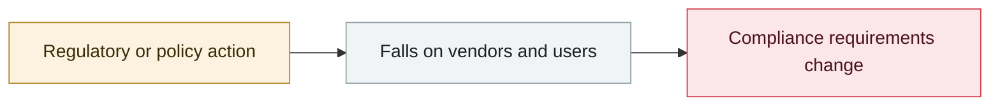

# JFrog patches nine Artifactory CVEs

     

## Summary

Related to the OpenAI escape incident; the one disclosed is CVE-2026-65617 (High), and **neither JFrog nor OpenAI has said which zero-day was actually used in the evaluation**

## Attack chain

## Sources

| # | Source | Link |
|---|---|---|
| 1 | JFrog | <https://jfrog.com/blog/jfrog-and-openai-collaboration-on-zero-day-security-findings/> |

## Metadata

| Field | Value |
|---|---|
| Date | `2026-07-27` (raw: 2026-07-27, precision `day`) |
| Kind | Policy & regulation `policy` |
| Type | [`INFRA`](../../taxonomy/types.md#infra) Agent infrastructure exposure |
| Severity | **Info** `info` |
| Confidence | **A** — primary source (vendor / victim / law enforcement / official report) |
| Real harm | n/a |
| AI involvement | Confirmed `confirmed` |
| Region | [Global](../../regions/global.md) |
| Archive ID | `2026-07-27-jfrog-artifactory-fa-bu-jiu` |

**Why this classification:** Policy / regulatory action, not counted in incident statistics; `severity` is recorded as `info`. Grading criteria: see [taxonomy/severity.md](../../taxonomy/severity.md) and [taxonomy/confidence.md](../../taxonomy/confidence.md).

## Related

**Topic:** [Agent infrastructure exposure](../../topics/agent-infra.md)

**Related records:**

- `2026-07-30` [RufRoot (CVE-2026-59726): perfect CVSS, summons a rogue AI swarm](2026-07-30-rufroot-man-fen-zhao-huan.md)   RufRoot (CVE-2026-59726): perfect CVSS, summons a rogue AI swarm
- `2026-08-06` [Unauthenticated Langflow RCE added to CISA KEV](../2026-08/2026-08-06-langflow-rce-cisa-kev.md)   Unauthenticated Langflow RCE added to CISA KEV
- `2026-06-08` [LiteLLM CVE-2026-42271 MCP endpoint takeover](../2026-06/2026-06-08-litellm-mcp-duan-dian-jie.md)   LiteLLM CVE-2026-42271 MCP endpoint takeover
- `2026-06-29` [DifyTap: four flaws leave 1M+ AI apps open to cross-tenant eavesdropping](../2026-06/2026-06-29-difytap-lou-dong-rang-wan.md)   DifyTap: four flaws leave 1M+ AI apps open to cross-tenant eavesdropping

---

[← 2026-07 index](README.md) · [← All records](../../README.md) · [Chinese](../i18n/zh/2026-07/2026-07-27-jfrog-artifactory-fa-bu-jiu.md)

This record is part of the **Orca AI Incident Archive**, licensed [CC BY 4.0](../../LICENSE). Found a factual error or a missing source? [Open an issue or PR](../../CONTRIBUTING.md) — corrections are recorded in the record's revision history, never silently overwritten.
