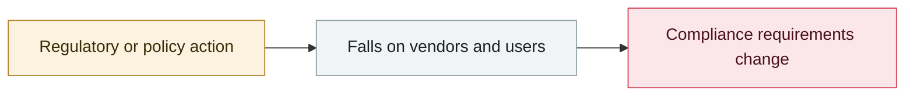

# NVIDIA convenes the Open Secure AI Alliance

     

## Summary

The notable argument: NVIDIA cites how **closed AI cannot tell attacker from defender and blocks forensic analysis** — Hugging Face had to switch to the open-weight **GLM 5.2** and build its own tooling to parse 17,000+ operations — and therefore urges policymakers to treat open models and tools as defensive assets, not to restrict them across the board

## Attack chain

## Sources

| # | Source | Link |
|---|---|---|
| 1 | NVIDIA | <https://blogs.nvidia.com/blog/open-secure-ai-alliance/> |

## Metadata

| Field | Value |
|---|---|
| Date | `2026-07-27` (raw: 2026-07-27, precision `day`) |
| Kind | Policy & regulation `policy` |
| Type | [`GOV`](../../taxonomy/types.md#gov) Governance & policy |
| Severity | **Info** `info` |
| Confidence | **A** — primary source (vendor / victim / law enforcement / official report) |
| Real harm | n/a |
| AI involvement | Confirmed `confirmed` |
| Region | [Global](../../regions/global.md) |
| Archive ID | `2026-07-27-nvidia-open-secure-alliance` |

**Why this classification:** Policy / regulatory action, not counted in incident statistics; `severity` is recorded as `info`. Grading criteria: see [taxonomy/severity.md](../../taxonomy/severity.md) and [taxonomy/confidence.md](../../taxonomy/confidence.md).

## Related

**Topic:** [Defense & governance](../../topics/defense.md)

**Related records:**

- `2026-07-17` [Anthropic, "A CISO's guide to agentic AI"](2026-07-17-anthropic-ciso-guide-agentic.md)   Anthropic, "A CISO's guide to agentic AI"
- `2026-07-23` [US representatives introduce the AI Kill Switch Act](2026-07-23-kill-switch-act.md)   US representatives introduce the AI Kill Switch Act
- `2026-07-28` ["Pacing the Frontier" open letter](2026-07-28-pacing-frontier-gong-kai-xin.md)   "Pacing the Frontier" open letter
- `2026-07-29` [Perplexity open-sources Numbat for agent behaviour monitoring](2026-07-29-perplexity-agent-numbat.md)   Perplexity open-sources Numbat for agent behaviour monitoring

---

[← 2026-07 index](README.md) · [← All records](../../README.md) · [Chinese](../i18n/zh/2026-07/2026-07-27-nvidia-open-secure-alliance.md)

This record is part of the **Orca AI Incident Archive**, licensed [CC BY 4.0](../../LICENSE). Found a factual error or a missing source? [Open an issue or PR](../../CONTRIBUTING.md) — corrections are recorded in the record's revision history, never silently overwritten.
