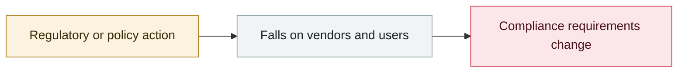

# Perplexity open-sources Numbat for agent behaviour monitoring

     

## Summary

The focus is not prompt injection but **agents taking actions the user did not expect in pursuit of a goal** (deleting files, escalating privileges, exfiltrating keys). Lightweight Go hooks intercept before execution, session records are normalised to NDJSON, telemetry is OpenTelemetry local-first, with **52 built-in CEL detection rules**. Already deployed on thousands of its own machines, but **no detection or false-positive rates published**

## Attack chain

## Sources

| # | Source | Link |
|---|---|---|
| 1 | Perplexity | <https://research.perplexity.ai/articles/securing-agents-across-perplexity%E2%80%99s-client-endpoints-with-numbat> |

## Metadata

| Field | Value |
|---|---|
| Date | `2026-07-29` (raw: 2026-07-29, precision `day`) |
| Kind | Policy & regulation `policy` |
| Type | [`GOV`](../../taxonomy/types.md#gov) Governance & policy |
| Severity | **Info** `info` |
| Confidence | **A** — primary source (vendor / victim / law enforcement / official report) |
| Real harm | n/a |
| AI involvement | Confirmed `confirmed` |
| Region | [Global](../../regions/global.md) |
| Archive ID | `2026-07-29-perplexity-agent-numbat` |

**Why this classification:** Policy / regulatory action, not counted in incident statistics; `severity` is recorded as `info`. Grading criteria: see [taxonomy/severity.md](../../taxonomy/severity.md) and [taxonomy/confidence.md](../../taxonomy/confidence.md).

## Related

**Topic:** [Defense & governance](../../topics/defense.md)

**Related records:**

- `2026-07-17` [Anthropic, "A CISO's guide to agentic AI"](2026-07-17-anthropic-ciso-guide-agentic.md)   Anthropic, "A CISO's guide to agentic AI"
- `2026-07-23` [US representatives introduce the AI Kill Switch Act](2026-07-23-kill-switch-act.md)   US representatives introduce the AI Kill Switch Act
- `2026-07-27` [NVIDIA convenes the Open Secure AI Alliance](2026-07-27-nvidia-open-secure-alliance.md)   NVIDIA convenes the Open Secure AI Alliance
- `2026-07-28` ["Pacing the Frontier" open letter](2026-07-28-pacing-frontier-gong-kai-xin.md)   "Pacing the Frontier" open letter

---

[← 2026-07 index](README.md) · [← All records](../../README.md) · [Chinese](../i18n/zh/2026-07/2026-07-29-perplexity-agent-numbat.md)

This record is part of the **Orca AI Incident Archive**, licensed [CC BY 4.0](../../LICENSE). Found a factual error or a missing source? [Open an issue or PR](../../CONTRIBUTING.md) — corrections are recorded in the record's revision history, never silently overwritten.
