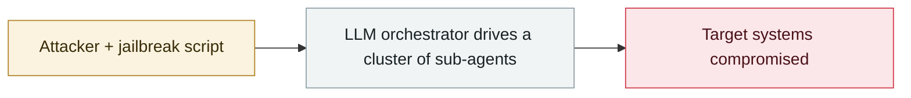

# Hermes Agent attacks Thailand's Ministry of Finance unattended

     

## Summary

Hunt.io (with Bob Diachenko): an exposed directory on a Hong Kong host shows the operators were running Hermes Agent in **YOLO (no human approval) mode**, delegating a LinPEAS privilege-escalation assessment and enumeration of the Permanent Secretary's Office web root; plus Hadoop-targeting scripts and an unpublished Go implant, **Hades**. **No evidence that files were taken, and the initial intrusion path is undetermined**. Thailand's CERT and NCSA were notified; the Ministry of Finance itself has not commented publicly

## Attack chain

## Sources

| # | Source | Link |
|---|---|---|
| 1 | Hunt.io | <https://hunt.io/blog/thailand-ministry-finance-targeted-with-hermes-ai-agent> |

## Metadata

| Field | Value |
|---|---|
| Date | `2026-07-30` (raw: 2026-07-30, precision `day`) |
| Kind | Incident `incident` |
| Type | [`WEAPON`](../../taxonomy/types.md#weapon) Agent used as a weapon |
| Severity | **Critical** `critical` |
| Confidence | **A** — primary source (vendor / victim / law enforcement / official report) |
| Real harm | Yes |
| AI involvement | Confirmed `confirmed` |
| Region | [Southeast Asia](../../regions/sea.md) |
| Archive ID | `2026-07-30-hermes-agent-thailand-finance-ministry` |

**Why this classification:** Real incident with a confirmed victim. Rated `critical`: confirmed real damage at the multi-organization / government / critical-infrastructure / supply-chain-worm level, or a first-of-its-kind capability milestone with real victims. Grading criteria: see [taxonomy/severity.md](../../taxonomy/severity.md) and [taxonomy/confidence.md](../../taxonomy/confidence.md).

## Related

**Topic:** [Offensive AI capability evolution](../../topics/offensive-ai.md)

**Related records:**

- `2026-09-22` [Gambit: three AI harnesses stole 600,000 card records from online retailers](../2026-09/2026-09-22-gambit-ai-agent-retail-card-theft.md)   Same open-source Hermes framework, two months later, running the campaign
- `2026-07-01` [Taiwan's nuclear safety commission and other agencies breached by an agent swarm](2026-07-01-taiwan-government-agent-swarm.md)   Taiwan's nuclear safety commission and other agencies breached by an agent swarm
- `2026-07-01` [JADEPUFFER: first ransomware driven end-to-end by an LLM](2026-07-01-jadepuffer-first-llm-driven-ransomware.md)   JADEPUFFER: first ransomware driven end-to-end by an LLM
- `2026-07-09` [OpenAI's agents breach Hugging Face](2026-07-09-openai-agents-breach-huggingface.md)   OpenAI's agents breach Hugging Face
- `2026-07-30` [Unit 42: autonomous campaigns run by Chinese-speaking operators](2026-07-30-unit42-chinese-speaking-autonomous-campaigns.md)   Unit 42: autonomous campaigns run by Chinese-speaking operators

---

[← 2026-07 index](README.md) · [← All records](../../README.md) · [Chinese](../i18n/zh/2026-07/2026-07-30-hermes-agent-thailand-finance-ministry.md)

This record is part of the **Orca AI Incident Archive**, licensed [CC BY 4.0](../../LICENSE). Found a factual error or a missing source? [Open an issue or PR](../../CONTRIBUTING.md) — corrections are recorded in the record's revision history, never silently overwritten.
