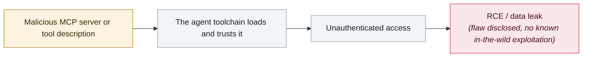

# RufRoot (CVE-2026-59726): perfect CVSS, summons a rogue AI swarm

      

## Summary

Named by Noma Security, **CVSS 10.0**, affecting all Ruflo versions < 3.16.3. **The default docker-compose deployment exposes the MCP bridge's `POST /mcp` and `POST /mcp/:group` endpoints without authentication** — an unauthenticated network attacker can call `terminal_execute` directly via `tools/call`, get a shell as `node` inside the bridge container, read provider API keys, **summon an agent swarm with the victim's keys**, and **inject poisoning patterns into the AgentDB learning store, tampering with the AI output of every user**

## Attack chain

## Sources

| # | Source | Link |
|---|---|---|
| 1 | THN | <https://thehackernews.com/2026/07/ruflo-mcp-flaw-lets-unauthenticated.html> |
| 2 | SecurityWeek | <https://www.securityweek.com/critical-ruflo-flaw-lets-attackers-spawn-rogue-ai-swarms/amp/> |

## Metadata

| Field | Value |
|---|---|
| Date | `2026-07-30` (raw: 2026-07-30, precision `day`) |
| Kind | Vulnerability disclosure `vulnerability` |
| Type | [`MCP`](../../taxonomy/types.md#mcp) MCP & tool-chain · [`INFRA`](../../taxonomy/types.md#infra) Agent infrastructure exposure |
| Severity | **High** `high` |
| Confidence | **A** — primary source (vendor / victim / law enforcement / official report) |
| Real harm | No |
| AI involvement | Confirmed `confirmed` |
| Region | [Global](../../regions/global.md) |
| Archive ID | `2026-07-30-rufroot-man-fen-zhao-huan` |

**Why this classification:** Vulnerability disclosure; as of archiving there is no evidence of in-the-wild exploitation, so `real_harm: false`. Rated `high`: real damage is limited in scope, or it is a CVSS 9+ severe flaw, or a capability demonstration of significance. Grading criteria: see [taxonomy/severity.md](../../taxonomy/severity.md) and [taxonomy/confidence.md](../../taxonomy/confidence.md).

## Related

**Topic:** [Agent supply-chain poisoning](../../topics/agent-supply-chain.md) · [Agent infrastructure exposure](../../topics/agent-infra.md)

**Related records:**

- `2026-07-01` [AWS Kiro: ask it to summarise a web page, get RCE (CVE-2026-10591)](2026-07-01-aws-kiro-rce.md)   AWS Kiro: ask it to summarise a web page, get RCE (CVE-2026-10591)
- `2026-07-27` [JFrog patches nine Artifactory CVEs](2026-07-27-jfrog-artifactory-fa-bu-jiu.md)   JFrog patches nine Artifactory CVEs
- `2026-08-06` [Unauthenticated Langflow RCE added to CISA KEV](../2026-08/2026-08-06-langflow-rce-cisa-kev.md)   Unauthenticated Langflow RCE added to CISA KEV
- `2026-06-08` [LiteLLM CVE-2026-42271 MCP endpoint takeover](../2026-06/2026-06-08-litellm-mcp-duan-dian-jie.md)   LiteLLM CVE-2026-42271 MCP endpoint takeover

---

[← 2026-07 index](README.md) · [← All records](../../README.md) · [Chinese](../i18n/zh/2026-07/2026-07-30-rufroot-man-fen-zhao-huan.md)

This record is part of the **Orca AI Incident Archive**, licensed [CC BY 4.0](../../LICENSE). Found a factual error or a missing source? [Open an issue or PR](../../CONTRIBUTING.md) — corrections are recorded in the record's revision history, never silently overwritten.
