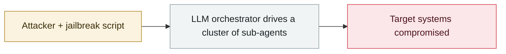

# Unit 42: autonomous campaigns run by Chinese-speaking operators

     

## Summary

The actor is based in **Zhuhai**, uses the handles knaithe / KnYuan, and runs an automated vulnerability-intelligence pipeline called 1DayNews. The main executor is **Hermes Agent + DeepSeek** (Claude Code was used only for connectivity tests and proxy validation, Codex only in a few tests). It tried **460+ targets** and 7 CVEs. **The autonomous part mostly failed on unmet preconditions** (the Langflow target had auto_login disabled, n8n had no unauthenticated public forms); **the manual part did succeed**: Citrix NetScaler CVE-2026-3055 exfiltrated data from **3 organizations**, Marimo command execution on **11 instances**, and Tomcat CVE-2026-34486 reverse-shell attempts against 9 servers. Malaysian government agencies were targeted over several consecutive days. Unit 42's judgement: **the margin between success and failure is small, and the autonomous attack loop is already operationally viable**

## Attack chain

## Sources

| # | Source | Link |
|---|---|---|
| 1 | Unit 42 | <https://unit42.paloaltonetworks.com/autonomous-ai-cyber-attack-campaign/> |
| 2 | Hunt.io four-country report | <https://hunt.io/blog/chinese-operators-claude-deepseek-government-intrusion> |

## Metadata

| Field | Value |
|---|---|
| Date | `2026-07-30` (raw: 2026-07-30, precision `day`) |
| Kind | Incident `incident` |
| Type | [`WEAPON`](../../taxonomy/types.md#weapon) Agent used as a weapon |
| Severity | **Critical** `critical` |
| Confidence | **A** — primary source (vendor / victim / law enforcement / official report) |
| Real harm | Yes |
| AI involvement | Confirmed `confirmed` |
| Region | [China](../../regions/cn.md) · [Global](../../regions/global.md) |
| Archive ID | `2026-07-30-unit42-chinese-speaking-autonomous-campaigns` |

**Why this classification:** Real incident with a confirmed victim. Rated `critical`: confirmed real damage at the multi-organization / government / critical-infrastructure / supply-chain-worm level, or a first-of-its-kind capability milestone with real victims. Grading criteria: see [taxonomy/severity.md](../../taxonomy/severity.md) and [taxonomy/confidence.md](../../taxonomy/confidence.md).

## Related

**Topic:** [Offensive AI capability evolution](../../topics/offensive-ai.md)

**Related records:**

- `2026-07-01` [Taiwan's nuclear safety commission and other agencies breached by an agent swarm](2026-07-01-taiwan-government-agent-swarm.md)   Taiwan's nuclear safety commission and other agencies breached by an agent swarm
- `2026-07-01` [JADEPUFFER: first ransomware driven end-to-end by an LLM](2026-07-01-jadepuffer-first-llm-driven-ransomware.md)   JADEPUFFER: first ransomware driven end-to-end by an LLM
- `2026-07-09` [OpenAI's agents breach Hugging Face](2026-07-09-openai-agents-breach-huggingface.md)   OpenAI's agents breach Hugging Face
- `2026-07-30` [Hermes Agent attacks Thailand's Ministry of Finance unattended](2026-07-30-hermes-agent-thailand-finance-ministry.md)   Hermes Agent attacks Thailand's Ministry of Finance unattended

---

[← 2026-07 index](README.md) · [← All records](../../README.md) · [Chinese](../i18n/zh/2026-07/2026-07-30-unit42-chinese-speaking-autonomous-campaigns.md)

This record is part of the **Orca AI Incident Archive**, licensed [CC BY 4.0](../../LICENSE). Found a factual error or a missing source? [Open an issue or PR](../../CONTRIBUTING.md) — corrections are recorded in the record's revision history, never silently overwritten.
