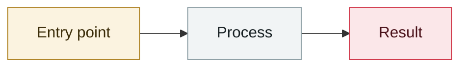

# N-able N-central zero-day exploited in the wild

     

## Summary

Adlumin MDR detected exploitation of an unknown flaw in a customer environment; the attacker used Take Control to connect to managed endpoints and registered a **Cloudflare tunnel** for persistence. CVE-2026-18556 / 18577; two hotfixes on 08-02 and 08-06

## Attack chain

## Sources

| # | Source | Link |
|---|---|---|
| 1 | N-able | <https://www.n-able.com/blog/n-central-security-update-august-2-2026> |

## Metadata

| Field | Value |
|---|---|
| Date | `2026-07-31` (raw: 2026-07-31, precision `day`) |
| Kind | Incident `incident` |
| Type | [`OTHER`](../../taxonomy/types.md#other) Other |
| Severity | **High** `high` |
| Confidence | **A** — primary source (vendor / victim / law enforcement / official report) |
| Real harm | Yes |
| AI involvement | Confirmed `confirmed` |
| Region | [Global](../../regions/global.md) |
| Archive ID | `2026-07-31-able-central-ling-ye-li` |

**Why this classification:** Real incident with a confirmed victim. Rated `high`: real damage is limited in scope, or it is a CVSS 9+ severe flaw, or a capability demonstration of significance. Grading criteria: see [taxonomy/severity.md](../../taxonomy/severity.md) and [taxonomy/confidence.md](../../taxonomy/confidence.md).

---

[← 2026-07 index](README.md) · [← All records](../../README.md) · [Chinese](../i18n/zh/2026-07/2026-07-31-able-central-ling-ye-li.md)

This record is part of the **Orca AI Incident Archive**, licensed [CC BY 4.0](../../LICENSE). Found a factual error or a missing source? [Open an issue or PR](../../CONTRIBUTING.md) — corrections are recorded in the record's revision history, never silently overwritten.
