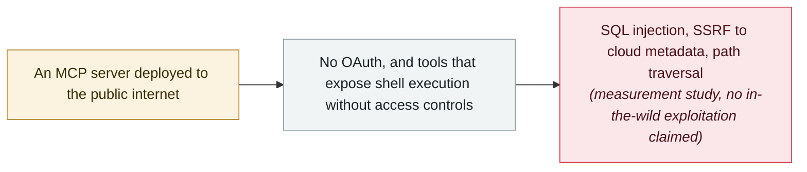

# Exposed by Design: a dynamic audit of 414 internet-facing MCP servers finds 68 vulnerabilities

      

## Summary

**Nicolás Padilla** posts **Exposed by Design** (arXiv 2608.00150), which the author describes as the first dynamic behavioural security assessment of internet-facing **MCP servers**. Servers were discovered across eleven sources — among them GitHub, npm, PyPI, Smithery, Hugging Face, Shodan, Censys and FOFA — and then tested live with **Corvus**, a purpose-built framework of 34 test modules covering 10 MCP-specific vulnerability classes. Over four measurement runs in July 2026 the study confirmed **640 production servers**, dynamically audited **414** and found **68 reportable vulnerabilities**, including SQL injection, SSRF against cloud metadata services, prompt-template injection and path traversal. **91.8% of the audited servers lack OAuth authentication**, **687 tool instances expose shell execution without access controls**, and **41.6% of confirmed servers disappeared within three days** between runs. Corvus is released as open source; no in-the-wild exploitation is claimed

## Attack chain

## Details

**Testing behaviour, not reading manifests.** The paper starts from the observation that MCP has, since its November 2024 launch, grown to more than 21,000 server instances detectable on the public internet, and sets out to test what those servers do when they are running — which is why the author calls it a dynamic behavioural assessment. Its method has two halves. Passive discovery draws candidate servers from eleven data sources, from package registries (npm, PyPI) and MCP directories (Smithery) to internet-wide scanners (Shodan, Censys, FOFA). Active testing then runs **Corvus**, a framework the author built for the study and has released as open source, with 34 test modules covering 10 MCP-specific vulnerability classes. Four measurement runs across July 2026 confirmed 640 production servers; 414 of them were audited dynamically, and the audit produced 68 reportable vulnerabilities — SQL injection, SSRF aimed at cloud metadata services, prompt-template injection, and path traversal through cursor manipulation.

**Three numbers worth keeping.** First, **91.8% of the dynamically audited servers lack OAuth authentication** — the control the MCP specification provides for exactly this deployment shape. Second, **687 tool instances across the confirmed servers expose shell execution capabilities without access controls**: a remote party who can reach the server can ask it to run commands. Third, **41.6% of confirmed servers disappeared within three days** between consecutive measurement runs, which the author reads as rapid deployment cycles without security review. That last figure matters for defenders as much as the first two: an inventory of exposed MCP servers ages within days, so a one-off scan understates what is actually reachable at any given moment.

**How to read it.** This is a single-author preprint, not yet peer-reviewed, and its 68 findings carry no CVE identifiers or vendor advisories; the paper reports a responsible-disclosure pipeline for them but no in-the-wild exploitation. It is recorded because the exposure it measures is not hypothetical elsewhere in this archive: an exposed MCP endpoint in nginx-ui was attacked in the wild in April 2026, and an authentication bypass in LiteLLM's MCP endpoint reached CISA's Known Exploited Vulnerabilities catalog in September. The recommendation that follows is unglamorous — put authentication in front of every internet-reachable MCP server, and do not expose shell-capable tools to callers you cannot identify.

## Sources

| # | Source | Link |
|---|---|---|
| 1 | arXiv 2608.00150 | <https://arxiv.org/abs/2608.00150> |

## Metadata

| Field | Value |
|---|---|
| Date | `2026-07-31` (raw: 2026-07-31, precision `day`) |
| Kind | Research demo `research` |
| Type | [`MCP`](../../taxonomy/types.md#mcp) MCP & tool-chain · [`INFRA`](../../taxonomy/types.md#infra) Agent infrastructure exposure |
| Severity | **Medium** `medium` |
| Confidence | **B** — a single-author academic preprint with a checkable method and an open-source tool, but no CVE or vendor advisory to anchor its findings |
| Real harm | No |
| AI involvement | Confirmed `confirmed` |
| Region | [Global](../../regions/global.md) |
| Archive ID | `2026-07-31-exposed-by-design-mcp-servers` |

**Why this classification:** A measurement study with live testing, `real_harm: false`; the record marks when this exposure was quantified. Rated `medium`: a controlled measurement of exposure at scale rather than a demonstrated compromise. Graded `B` because the preprint is not peer-reviewed and none of its findings is anchored by a CVE or vendor advisory. Dated to the arXiv v1 submission (31 July 2026). Grading criteria: see [taxonomy/severity.md](../../taxonomy/severity.md) and [taxonomy/confidence.md](../../taxonomy/confidence.md).

## Related

**Topic:** [Agent supply-chain poisoning](../../topics/agent-supply-chain.md) · [Agent infrastructure exposure](../../topics/agent-infra.md)

**Related records:**

- `2026-04-16` [MCPwn (CVE-2026-33032): nginx-ui MCP endpoint hit in the wild](../2026-04/2026-04-16-mcpwn-nginx-ui-in-the-wild.md)   An exposed MCP endpoint that was actually attacked
- `2026-09-02` [Any bearer token opens LiteLLM's MCP endpoint: CVE-2026-59822 enters CISA KEV](../2026-09/2026-09-02-litellm-mcp-auth-bypass-kev.md)   An MCP authentication flaw that reached CISA KEV
- `2025-06-13` [MCP Inspector unauthenticated RCE](../2025-06/2025-06-13-mcp-inspector-rce.md)   Missing authentication on MCP tooling, a year earlier
- `2026-08-10` [Deadbugz: an MCP server that turns hostile on the third tool call](../2026-08/2026-08-10-deadbugz-mcp-supply-chain.md)   Why a one-time review of an MCP server is not enough

---

[← 2026-07 index](README.md) · [← All records](../../README.md) · [Chinese](../i18n/zh/2026-07/2026-07-31-exposed-by-design-mcp-servers.md)

This record is part of the **Orca AI Incident Archive**, licensed [CC BY 4.0](../../LICENSE). Found a factual error or a missing source? [Open an issue or PR](../../CONTRIBUTING.md) — corrections are recorded in the record's revision history, never silently overwritten.
