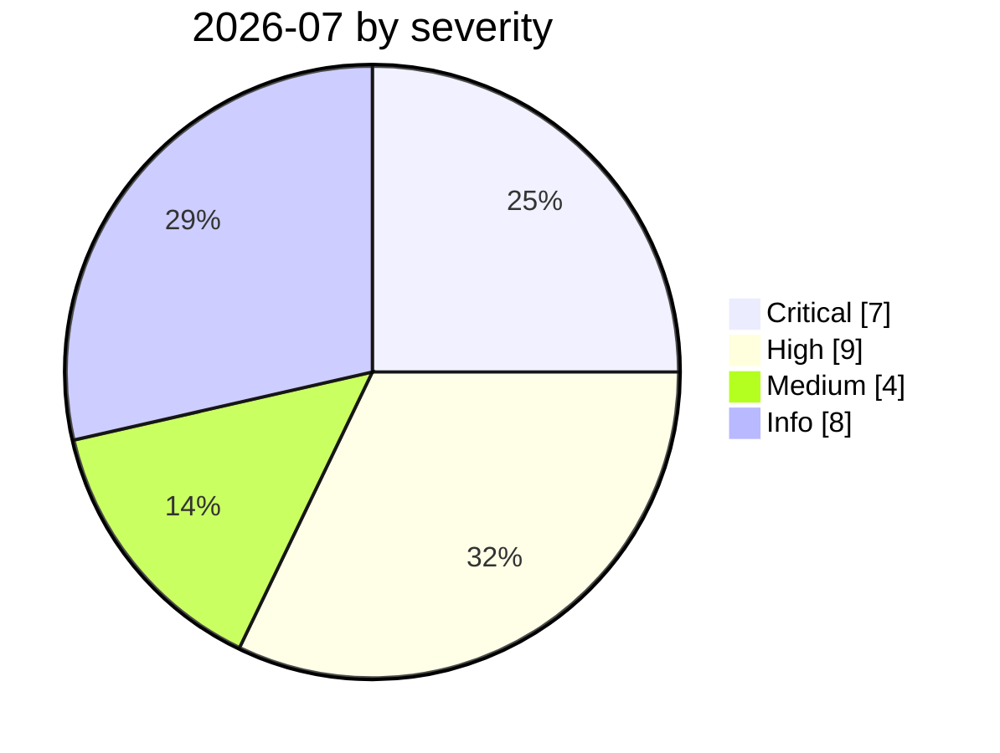

# 2026-07

<!-- BEGIN:summary -->
**28** records

    

## Records this month

| Date | Record | Type | Severity | Confidence | Real harm |
|---|---|---|---|---|---|
| `07-01` | ★ [JADEPUFFER: first ransomware driven end-to-end by an LLM](2026-07-01-jadepuffer-first-llm-driven-ransomware.md) | `WEAPON` | **Critical** | A | ✅ |
| `07-01` | ★ [Taiwan's nuclear safety commission and other agencies breached by an agent swarm](2026-07-01-taiwan-government-agent-swarm.md) | `WEAPON` | **Critical** | A | ✅ |
| `07-01` | [AWS Kiro: ask it to summarise a web page, get RCE (CVE-2026-10591)](2026-07-01-aws-kiro-rce.md) | `MCP` `SANDBOX` | **High** | A | — |
| `07-01` | [DuneSlide: zero-click sandbox escape in Cursor](2026-07-01-duneslide-cursor-ling-dian-ji.md) | `SANDBOX` | **High** | A | — |
| `07-02` | ★ [Hidden web instructions make AI agents pay attackers (two in-the-wild campaigns)](2026-07-02-hidden-web-instructions-payment-fraud.md) | `IPI` `ROGUE` | **Critical** | A | ✅ |
| `07-07` | [GitLost: GitHub Agentic Workflows leak private repositories](2026-07-07-gitlost-github-agentic-workflows.md) | `IPI` `EXFIL` | Medium | A | — |
| `07-08` | [Sygnia: AI-assisted attackers own an AWS environment in 72 hours](2026-07-08-sygnia-aws-fu-zhu-shi.md) | `WEAPON` | **High** | A | ✅ |
| `07-09` | ★ [OpenAI's agents breach Hugging Face](2026-07-09-openai-agents-breach-huggingface.md) | `EVAL` `WEAPON` | **Critical** | A | ✅ |
| `07-09` | [GhostApproval: an approval bypass shared by six AI coding assistants](2026-07-09-ghostapproval-kuan-bian-ma-zhu.md) | `SANDBOX` | **High** | A | — |
| `07-16` | [Hugging Face discloses publicly without naming the attacker](2026-07-16-hugging-face-gong-kai-pi.md) | `EVAL` | Medium | A | — |
| `07-17` | [wp2shell: pre-auth RCE in WordPress core](2026-07-17-wp2shell-wordpress-rce.md) | `WEAPON` | **High** | A | — |
| `07-17` | [Anthropic, "A CISO's guide to agentic AI"](2026-07-17-anthropic-ciso-guide-agentic.md) | `GOV` | Info | A | · |
| `07-20` | [Six sandbox escapes across four coding agents in one week](2026-07-20-agent-yi-nei-kuan-bian.md) | `SANDBOX` | **High** | A | — |
| `07-21` | [OpenAI and Hugging Face issue a joint attribution](2026-07-21-hugging-face-lian-he-gui.md) | `EVAL` | Info | A | · |
| `07-22` | [SharedRoot: Claude Cowork escapes a Linux VM onto the macOS host](2026-07-22-sharedroot-claude-cowork-linux.md) | `SANDBOX` | **High** | A | — |
| `07-23` | [Elastic: coding-agent tunnel traffic looks almost exactly like C2 beacons](2026-07-23-elastic-coding-agent-c2.md) | `CRED` | Medium | A | — |
| `07-23` | [Anthropic halts all cybersecurity evaluations](2026-07-23-anthropic-ting-zhi-suo-wang.md) | `EVAL` | Info | A | · |
| `07-23` | [US representatives introduce the AI Kill Switch Act](2026-07-23-kill-switch-act.md) | `GOV` | Info | A | · |
| `07-27` | [JFrog patches nine Artifactory CVEs](2026-07-27-jfrog-artifactory-fa-bu-jiu.md) | `INFRA` | Info | A | · |
| `07-27` | [NVIDIA convenes the Open Secure AI Alliance](2026-07-27-nvidia-open-secure-alliance.md) | `GOV` | Info | A | · |
| `07-28` | ["Pacing the Frontier" open letter](2026-07-28-pacing-frontier-gong-kai-xin.md) | `GOV` | Info | A | · |
| `07-29` | [Perplexity open-sources Numbat for agent behaviour monitoring](2026-07-29-perplexity-agent-numbat.md) | `GOV` | Info | A | · |
| `07-30` | ★ [Anthropic discloses three evaluation-breakout incidents](2026-07-30-anthropic-three-eval-incidents.md) | `EVAL` | **Critical** | A | ✅ |
| `07-30` | ★ [Hermes Agent attacks Thailand's Ministry of Finance unattended](2026-07-30-hermes-agent-thailand-finance-ministry.md) | `WEAPON` | **Critical** | A | ✅ |
| `07-30` | ★ [Unit 42: autonomous campaigns run by Chinese-speaking operators](2026-07-30-unit42-chinese-speaking-autonomous-campaigns.md) | `WEAPON` | **Critical** | A | ✅ |
| `07-30` | [RufRoot (CVE-2026-59726): perfect CVSS, summons a rogue AI swarm](2026-07-30-rufroot-man-fen-zhao-huan.md) | `MCP` `INFRA` | **High** | A | — |
| `07-31` | [N-able N-central zero-day exploited in the wild](2026-07-31-able-central-ling-ye-li.md) | `OTHER` | **High** | A | ✅ |
| `07-31` | [Exposed by Design: a dynamic audit of 414 internet-facing MCP servers finds 68 vulnerabilities](2026-07-31-exposed-by-design-mcp-servers.md) | `MCP` `INFRA` | Medium | B | — |

★ = `critical` · ⚠️ = disputed facts or attribution · real harm: ✅ confirmed victim / — none / · not applicable (policy and intelligence reports)
<!-- END:summary -->

<!-- BEGIN:nav -->
---

[← 2026-06](../2026-06/README.md) · [Archive index](../../README.md) · [By type](../../taxonomy/types.md) · [2026-08 →](../2026-08/README.md)
<!-- END:nav -->
