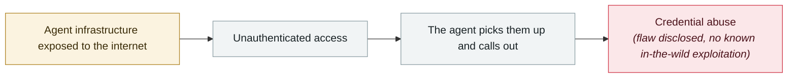

# Azure SRE Agent privilege escalation (CVE-2026-62830)

      

## Summary

**CVSS 9.9**, missing authorization. Exploiting **a failure in the Scope-Changed OBO (on-behalf-of) flow**, an attacker can **inherit the agent's managed identity** and then modify runbooks, telemetry and infrastructure. The blast radius is not just the agent itself but **every infrastructure resource its managed identity can reach** — runbooks, telemetry, incident-handling tools and all the Azure resources they involve. Microsoft's fix is **server-side (customers need to patch nothing)**, and it recommends auditing managed identity assignments, reviewing RBAC, and monitoring for anomalous privilege escalation

## Attack chain

## Sources

| # | Source | Link |
|---|---|---|
| 1 | MSRC/OpenCVE | <https://app.opencve.io/cve/CVE-2026-62830> |
| 2 | Talos Patch Tuesday | <https://blog.talosintelligence.com/microsoft-patch-tuesday-for-august-2026/> |

## Metadata

| Field | Value |
|---|---|
| Date | `2026-08-01` (raw: 2026-08, precision `month`) |
| Kind | Vulnerability disclosure `vulnerability` |
| Type | [`INFRA`](../../taxonomy/types.md#infra) Agent infrastructure exposure · [`CRED`](../../taxonomy/types.md#cred) Credential abuse |
| Severity | **High** `high` |
| Confidence | **A** — primary source (vendor / victim / law enforcement / official report) |
| Real harm | No |
| AI involvement | Confirmed `confirmed` |
| Region | [Global](../../regions/global.md) |
| Archive ID | `2026-08-01-azure-sre-agent` |

**Why this classification:** Vulnerability disclosure; as of archiving there is no evidence of in-the-wild exploitation, so `real_harm: false`. Rated `high`: real damage is limited in scope, or it is a CVSS 9+ severe flaw, or a capability demonstration of significance. Grading criteria: see [taxonomy/severity.md](../../taxonomy/severity.md) and [taxonomy/confidence.md](../../taxonomy/confidence.md).

## Related

**Topic:** [Agent infrastructure exposure](../../topics/agent-infra.md)

**Related records:**

- `2026-08-04` [CHAINDROP npm worm](2026-08-04-chaindrop-npm-ru-chong.md)   CHAINDROP npm worm
- `2026-08-06` [Unauthenticated Langflow RCE added to CISA KEV](2026-08-06-langflow-rce-cisa-kev.md)   Unauthenticated Langflow RCE added to CISA KEV
- `2026-08-25` [NemoClaw (CVE-2026-65105): DNS rebinding rewrites the model's chat template](2026-08-25-nemoclaw-dns-zhong-bang-ding.md)   NemoClaw (CVE-2026-65105): DNS rebinding rewrites the model's chat template
- `2026-08-17` [AI finds a flaw AI helped write: Snowflake's Jira token](2026-08-17-snowflake-jira-zhao-dao-can.md)   AI finds a flaw AI helped write: Snowflake's Jira token

---

[← 2026-08 index](README.md) · [← All records](../../README.md) · [Chinese](../i18n/zh/2026-08/2026-08-01-azure-sre-agent.md)

This record is part of the **Orca AI Incident Archive**, licensed [CC BY 4.0](../../LICENSE). Found a factual error or a missing source? [Open an issue or PR](../../CONTRIBUTING.md) — corrections are recorded in the record's revision history, never silently overwritten.
