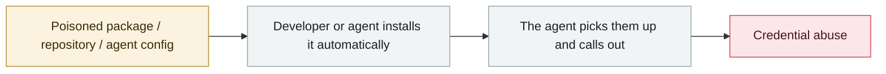

# CHAINDROP npm worm

      

## Summary

The GitHub account of a `keyv` maintainer was compromised → **400+ packages** poisoned by a self-replicating worm. Because it pushed straight to main and published immediately, **the poisoned versions shipped with valid provenance signatures**. A preinstall hook pulls Bun 1.3.13 to run an obfuscated payload that, beyond npm/cloud credentials, **specifically harvests credentials for AI development tools such as Anthropic, Codex, Cursor and Gemini**.

**The most dangerous part**: if the stolen credentials include a GitHub App token (`ghs_`), the worm commits malicious `.claude/settings.json` and `.vscode/tasks.json` to branches of reachable repositories (up to 50 per repo) — **a developer is infected simply by opening the repo in VS Code or starting one Claude Code session, with no `npm install` required**. Elastic recommends upgrading to npm 12+, which disables preinstall by default

## Attack chain

## Sources

| # | Source | Link |
|---|---|---|
| 1 | Elastic | <https://www.elastic.co/security-labs/shai-hulud-chaindrop-npm-supply-chain> |
| 2 | Microsoft | <https://www.microsoft.com/en-us/security/blog/2026/08/04/chaindrop-supply-chain-compromise-anatomy-self-propagating-worm/> |
| 3 | Wiz | <https://www.wiz.io/blog/keyv-and-cacheable-npm-supply-chain-attack> |
| 4 | Orca | <https://orca.security/resources/blog/compromised-keyv-npm-supply-chain-attack/> |
| 5 | Singapore CSA advisory | <https://www.csa.gov.sg/alerts-and-advisories/advisories/ad-2026-009/> |

## Metadata

| Field | Value |
|---|---|
| Date | `2026-08-04` (raw: 2026-08-04, precision `day`) |
| Kind | Incident `incident` |
| Type | [`SUPPLY`](../../taxonomy/types.md#supply) Supply-chain poisoning · [`CRED`](../../taxonomy/types.md#cred) Credential abuse |
| Severity | **Critical** `critical` |
| Confidence | **A** — primary source (vendor / victim / law enforcement / official report) |
| Real harm | Yes |
| AI involvement | Confirmed `confirmed` |
| Region | [Global](../../regions/global.md) |
| Archive ID | `2026-08-04-chaindrop-npm-ru-chong` |

**Why this classification:** Real incident with a confirmed victim. Rated `critical`: confirmed real damage at the multi-organization / government / critical-infrastructure / supply-chain-worm level, or a first-of-its-kind capability milestone with real victims. Grading criteria: see [taxonomy/severity.md](../../taxonomy/severity.md) and [taxonomy/confidence.md](../../taxonomy/confidence.md).

## Related

**Topic:** [Agent supply-chain poisoning](../../topics/agent-supply-chain.md)

**Related records:**

- `2026-08-01` [Azure SRE Agent privilege escalation (CVE-2026-62830)](2026-08-01-azure-sre-agent.md)   Azure SRE Agent privilege escalation (CVE-2026-62830)
- `2026-08-17` [AI finds a flaw AI helped write: Snowflake's Jira token](2026-08-17-snowflake-jira-zhao-dao-can.md)   AI finds a flaw AI helped write: Snowflake's Jira token
- `2026-08-18` [Context7 MCP prompt injection (CVE-2026-75130)](2026-08-18-context7-mcp-ti-shi-zhu.md)   Context7 MCP prompt injection (CVE-2026-75130)
- `2026-09-01` [GitSpawn: a malicious .git/config runs attacker code in 7 coding agents before the model is ever contacted](../2026-09/2026-09-01-gitspawn-git-config-pre-model-rce.md)   GitSpawn: a malicious .git/config runs attacker code in 7 coding agents before the model is ever contacted

---

[← 2026-08 index](README.md) · [← All records](../../README.md) · [Chinese](../i18n/zh/2026-08/2026-08-04-chaindrop-npm-ru-chong.md)

This record is part of the **Orca AI Incident Archive**, licensed [CC BY 4.0](../../LICENSE). Found a factual error or a missing source? [Open an issue or PR](../../CONTRIBUTING.md) — corrections are recorded in the record's revision history, never silently overwritten.
