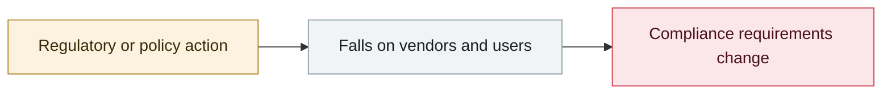

# OSAA publishes the SAFE draft for AI incident sharing (RFC)

     

## Summary

Contributions from Cisco, CrowdStrike, Hugging Face, NVIDIA and Red Hat, published as Black Hat USA 2026 opened. **Modelled on NASA's Aviation Safety Reporting System (ASRS)**: confidential voluntary reporting, rapid notification of affected organizations, joint analysis **aimed at learning rather than blame**, covering the whole AI run stack from models and guardrails to tools / execution environments / monitoring / human operations / supply-chain dependencies

## Attack chain

## Sources

| # | Source | Link |
|---|---|---|
| 1 | Linux Foundation | <https://www.linuxfoundation.org/blog/proposing-the-safe-working-group-an-open-community-effort-to-improve-ai-security> |
| 2 | NVIDIA | <https://blogs.nvidia.com/blog/open-secure-ai-alliance-contributions/> |

## Metadata

| Field | Value |
|---|---|
| Date | `2026-08-04` (raw: 2026-08-04, precision `day`) |
| Kind | Policy & regulation `policy` |
| Type | [`GOV`](../../taxonomy/types.md#gov) Governance & policy |
| Severity | **Info** `info` |
| Confidence | **A** — primary source (vendor / victim / law enforcement / official report) |
| Real harm | n/a |
| AI involvement | Confirmed `confirmed` |
| Region | [Global](../../regions/global.md) |
| Archive ID | `2026-08-04-osaa-safe-rfc` |

**Why this classification:** Policy / regulatory action, not counted in incident statistics; `severity` is recorded as `info`. Grading criteria: see [taxonomy/severity.md](../../taxonomy/severity.md) and [taxonomy/confidence.md](../../taxonomy/confidence.md).

## Related

**Topic:** [Defense & governance](../../topics/defense.md)

**Related records:**

- `2026-08-03` [CrowdStrike 2026 threat hunting report](2026-08-03-crowdstrike-wei-xie-shou-lie.md)   CrowdStrike 2026 threat hunting report
- `2026-08-06` [1Password: AI patches fully fix only 26% of the time](2026-08-06-password-bu-ding-wan-quan.md)   1Password: AI patches fully fix only 26% of the time
- `2026-08-07` [OpenAI: next-generation model Astra may reach Critical cyber capability](2026-08-07-astra-critical-yi-dai-mo.md)   OpenAI: next-generation model Astra may reach Critical cyber capability
- `2026-08-18` [OpenAI slows development and pauses RL training for two weeks](2026-08-18-rl-xuan-bu-fang-man.md)   OpenAI slows development and pauses RL training for two weeks

---

[← 2026-08 index](README.md) · [← All records](../../README.md) · [Chinese](../i18n/zh/2026-08/2026-08-04-osaa-safe-rfc.md)

This record is part of the **Orca AI Incident Archive**, licensed [CC BY 4.0](../../LICENSE). Found a factual error or a missing source? [Open an issue or PR](../../CONTRIBUTING.md) — corrections are recorded in the record's revision history, never silently overwritten.
